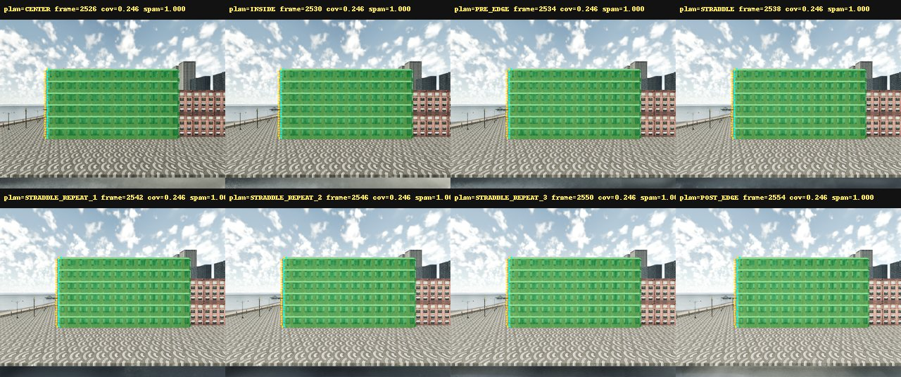
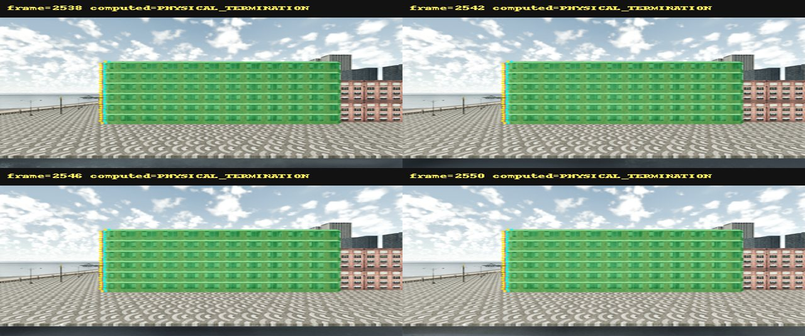

# ACT-0R1 Offline Physical-Boundary Audit

This audit reads only the eight existing sensor quartets under
`results/act0r1/raw`. CARLA was not started and no capture, locator search,
rollout, dataset expansion or JEPA training was run. The historical ACT-0R,
CAP-0 and ACT-0R1 validation files and the search checkpoint were not changed.

External visual review is **PENDING**.

## Provenance and integrity

| Check | Result |
| --- | --- |
| Raw files | 56/56 PASS |
| Manifest-recorded hashes | 48/48 PASS |
| Metadata payloads | 8/8 PASS |
| File sizes | 56/56 PASS |
| Sensor quartet frame/timestamp pairing | 8/8 PASS |
| Search checkpoint SHA-256 | PASS |
| Target instance | 39220 in all frames |

The raw file payload totals 34,190,124 bytes; `du -sb`, which includes the
directory entry, reports 34,194,220 bytes. Raw remains server-local and is not
tracked by Git.

The search checkpoint remains:

```text
a56310883bb15513ea25c97c919d7faf14edb217b1a05fb0c4e12b060c664f73
```

## Role-label independence

`CENTER`, `INSIDE`, `PRE_EDGE`, `STRADDLE` and `POST_EDGE` are retained
only as planned-pose names. They are not used as physical-boundary labels,
Tier V inputs or Tier M inputs. The four frozen frames were selected by
`T_world_camera` clustering and are frames 2538, 2542, 2546 and 2550.

All eight frames already contain the LEFT physical contour. Target coverage
remains approximately 0.246 and the contour span divided by the target-mask
bbox height is 1.0 in every frame. Therefore the planned names do not establish
an IN/PRE/STRADDLE event sequence in this raw set.

## Per-frame pixel evidence

| Frame | Planned role | Coverage | Mask bbox (x,y,w,h) | Span/bbox h | Computed boundary | Valid depth pairs | External-target depth (m) |
| ---: | --- | ---: | --- | ---: | --- | ---: | ---: |
| 2526 | CENTER | 0.245846 | 130,140,380,200 | 1.000 | PHYSICAL_TERMINATION | 96 | 34.190 |
| 2530 | INSIDE | 0.245840 | 154,140,380,200 | 1.000 | PHYSICAL_TERMINATION | 96 | 34.136 |
| 2534 | PRE_EDGE | 0.246162 | 162,140,380,200 | 1.000 | PHYSICAL_TERMINATION | 96 | 34.122 |
| 2538 | STRADDLE | 0.246172 | 162,140,380,200 | 1.000 | PHYSICAL_TERMINATION | 96 | 33.995 |
| 2542 | STRADDLE_REPEAT_1 | 0.246172 | 162,140,380,200 | 1.000 | PHYSICAL_TERMINATION | 96 | 33.995 |
| 2546 | STRADDLE_REPEAT_2 | 0.246172 | 162,140,380,200 | 1.000 | PHYSICAL_TERMINATION | 96 | 33.995 |
| 2550 | STRADDLE_REPEAT_3 | 0.246172 | 162,140,380,200 | 1.000 | PHYSICAL_TERMINATION | 96 | 33.995 |
| 2554 | POST_EDGE | 0.246169 | 170,140,380,200 | 1.000 | PHYSICAL_TERMINATION | 96 | 33.988 |

For each frozen frame, the LEFT contour has 200 target/external bilateral
samples. Of these, 96 pairs have finite non-sentinel depth. External Building
semantic fraction is 0.005, external non-target instance fraction is 1.0,
external-closer fraction is 0.0 and same-depth fraction is 0.0. The exterior
is mainly semantic tags 11, 2 and 23 and is substantially behind the target.
This supports a physical facade termination, not foreground occlusion or an
internal instance seam.

## Frozen-frame decision

```text
frame 2538: PHYSICAL_TERMINATION
frame 2542: PHYSICAL_TERMINATION
frame 2546: PHYSICAL_TERMINATION
frame 2550: PHYSICAL_TERMINATION
consensus: 4/4 (minimum required: 3/4)
```

Tier V uses only mask-derived target/external pixels. All four frozen frames
pass the unchanged thresholds: span/bbox height at least 0.8, target-side
fraction at least 0.8 and external-side fraction at least 0.8.

The action axis was derived from actual camera transforms as
`[-1, 0, 0]`, with 5.0625 m motion span and 0 m maximum orthogonal residual.
Plane-free z-depth back-projection gives an action-axis boundary coordinate of
116.792947 m in all four frozen frames:

```text
official Tier M spread: 0.000000 m
gate threshold:         0.250000 m
absolute accuracy:      NOT_EVALUATED
```

No legacy plane, bbox geometry, artificial boundary or planned role label
enters Tier M.

## Visual evidence





Each frozen frame also has an RGB bilateral-sample panel, depth-residual panel,
semantic panel and instance panel:

- [frame 2538](assets/act0r1/offline_straddle_2538_evidence.jpg)
- [frame 2542](assets/act0r1/offline_straddle_2542_evidence.jpg)
- [frame 2546](assets/act0r1/offline_straddle_2546_evidence.jpg)
- [frame 2550](assets/act0r1/offline_straddle_2550_evidence.jpg)

## Fault attribution

```text
TWO_GIB_ADDRESS_SPACE_FAILURE: CONFIRMED
HISTORICAL_TRIANGLE_ARTIFACT_ROOT_CAUSE:
  LIKELY_BUT_NOT_UNIQUELY_PROVEN
```

The first statement is supported by the failed 2 GiB probe and passing 4 GiB
OLD RGB reference. The second is intentionally weaker: historical RGB failed
while the fresh bounded stack passed, but no controlled single-variable
reproduction isolates one unique cause for the old triangle artifact.

## Gates

| Gate | Result |
| --- | --- |
| RAW_HASH_AUDIT | PASS |
| SENSOR_PAIRING | PASS |
| TARGET_MASK_PIXEL_VALID | PASS |
| ROLE_LABEL_INDEPENDENCE | PASS |
| LEFT_BOUNDARY_TYPE_RESOLVED | PASS: PHYSICAL_TERMINATION |
| TIER_V | PASS |
| OFFICIAL_TIER_M | PASS: spread 0.000 m |
| SAME_POSE_CONFIRMATION | PASS: 0 m / 0 deg |
| EXTERNAL_VISUAL_REVIEW | PENDING |
| READY_FOR_CANDIDATE1_RIGHT | CONDITIONAL_PASS |
| READY_FOR_COUNTERFACTUAL_ROLLOUT | NOT_EVALUATED |
| READY_FOR_JEPA | NOT_EVALUATED |

`READY_FOR_CANDIDATE1_RIGHT=CONDITIONAL_PASS` authorizes only a future,
separately bounded RIGHT capture. Because every current frame already contains
the LEFT contour, future acquisition must derive labels from pixels and must
not reuse these planned role names as observed states.
