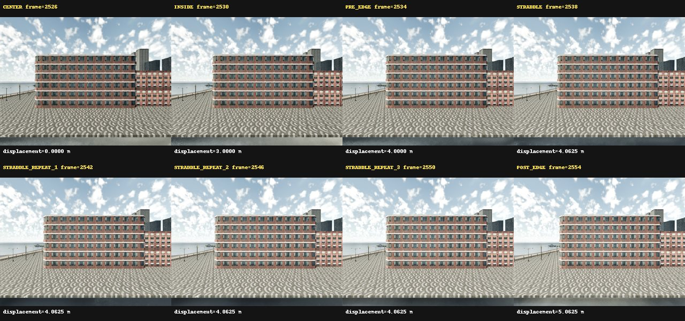
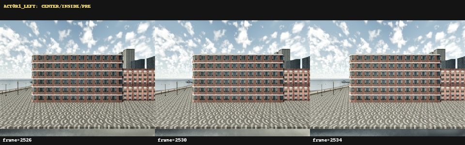
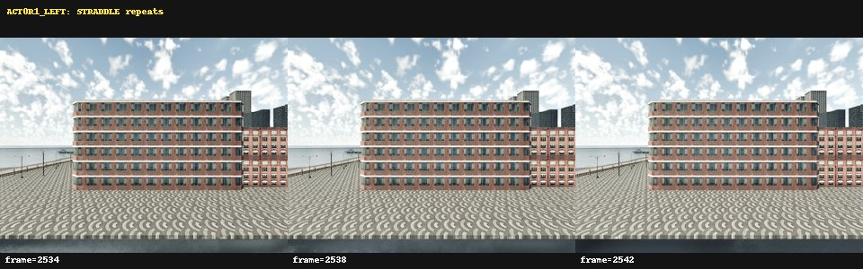
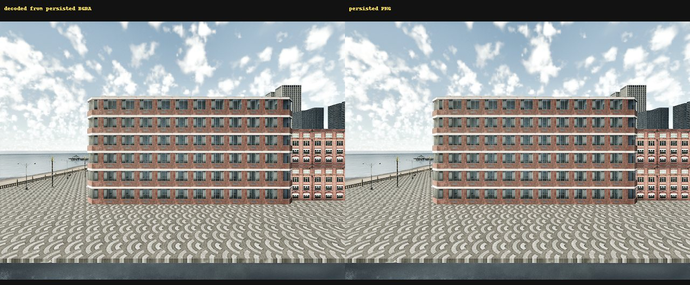
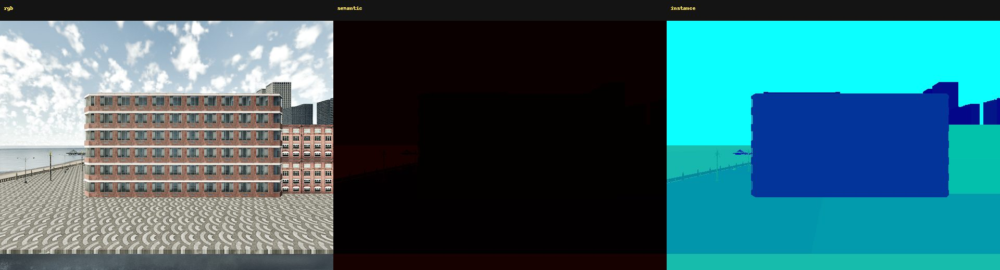

# ACT-0R1 Candidate 1 LEFT Recovery Pilot

ACT-0R1 ran only after CAP-0 passed under the 4 GiB Python limit. It read the
existing search checkpoint without modifying it:

```text
results/act0r/search_plan_checkpoint.json
a56310883bb15513ea25c97c919d7faf14edb217b1a05fb0c4e12b060c664f73
```

No locator search, RIGHT capture, other candidate, counterfactual rollout,
dataset expansion, model download or JEPA training ran.

## Captured frames

| Role | Frame | Timestamp | Commanded LEFT displacement (m) |
| --- | ---: | ---: | ---: |
| CENTER | 2526 | 51.452581 | 0.0000 |
| INSIDE | 2530 | 51.652581 | 3.0000 |
| PRE_EDGE | 2534 | 51.852581 | 4.0000 |
| STRADDLE | 2538 | 52.052581 | 4.0625 |
| STRADDLE_REPEAT_1 | 2542 | 52.252581 | 4.0625 |
| STRADDLE_REPEAT_2 | 2546 | 52.452581 | 4.0625 |
| STRADDLE_REPEAT_3 | 2550 | 52.652581 | 4.0625 |
| POST_EDGE | 2554 | 52.852581 | 5.0625 |

All four sensor frame IDs match in every row. Each teleport was followed by
three discarded settle ticks. Five complete warmup frames were discarded
before formal capture.

## Integrity and repeatability

| Metric | Result |
| --- | --- |
| RGB entropy range | 7.442-7.716 bits |
| RGB unique colors range | 59,332-61,464 |
| Frozen-pose consecutive SSIM | 0.9907, 0.9972, 0.9958 |
| Frozen-pose position error | 0.000 m |
| Frozen-pose rotation error | 0.000 deg |
| Target instance IDs | 39220 in all 8 frames |
| Repeated-tile pairs above 0.98 | 0 in every frame |
| Persisted BGRA versus PNG | exact |

SSIM across deliberately different positions ranges down to 0.730 and is
reported only as a movement diagnostic. It is not an integrity failure. The
0.90 threshold applies to the four frozen STRADDLE frames.

## Public visual evidence











The images show coherent geometry and the expected translational view change;
the former triangular copying and tiling failure is absent. Public external
visual review remains possible through these tracked JPG files.

## Gates

| Gate | Result |
| --- | --- |
| CAPTURE_STACK_RECOVERED | PASS |
| CANDIDATE1_LEFT_CAPTURE_COMPLETE | PASS |
| SENSOR_QUADRUPLET_PAIRING | PASS |
| RGB_VISUAL_INTEGRITY | PASS |
| SAME_POSE_CONFIRMATION | PASS |
| TARGET_INSTANCE_STABILITY | PASS |
| READY_TO_RESUME_ACT0R | PASS |
| READY_FOR_COUNTERFACTUAL_ROLLOUT | NOT_EVALUATED |
| READY_FOR_JEPA | NOT_EVALUATED |

`READY_TO_RESUME_ACT0R=PASS` means only that the bounded capture stack can
resume the remaining ACT-0R acquisition in a future task. It does not classify
candidate 1 LEFT as a physical termination and does not authorize a rollout.

Canonical pilot raw remains server-local at `results/act0r1/raw`
(34,194,220 bytes by `du -sb`) and is ignored by Git.
