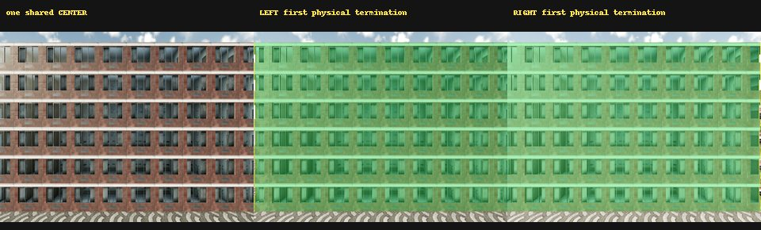
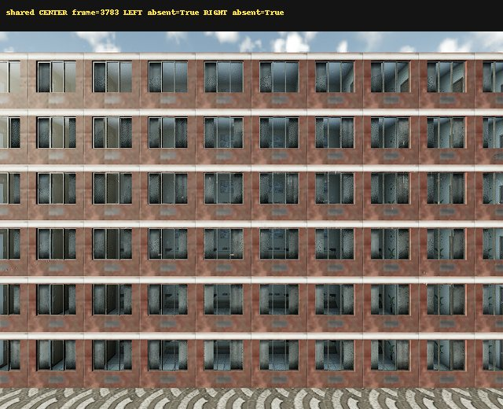
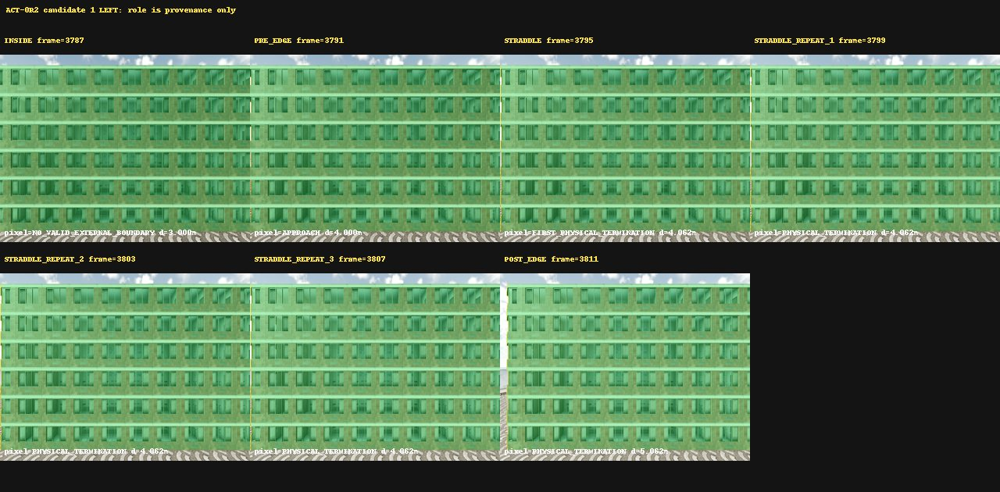
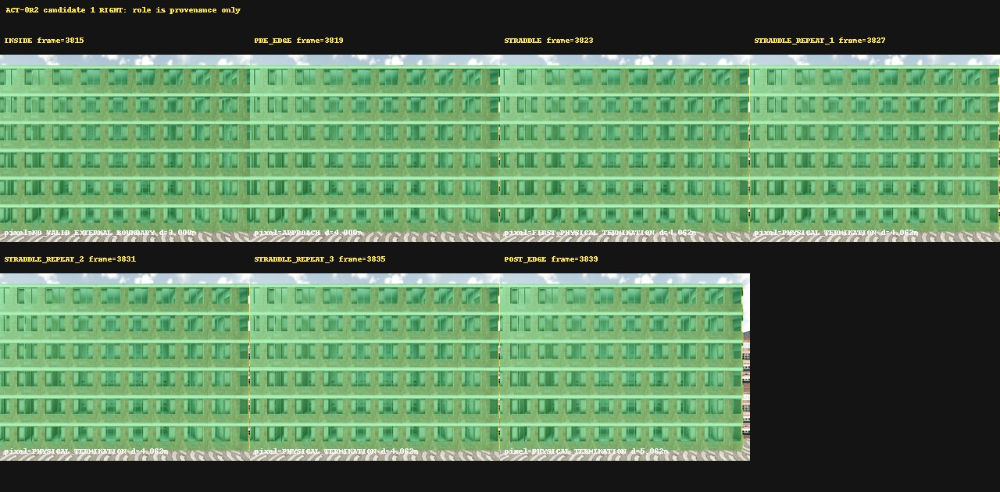
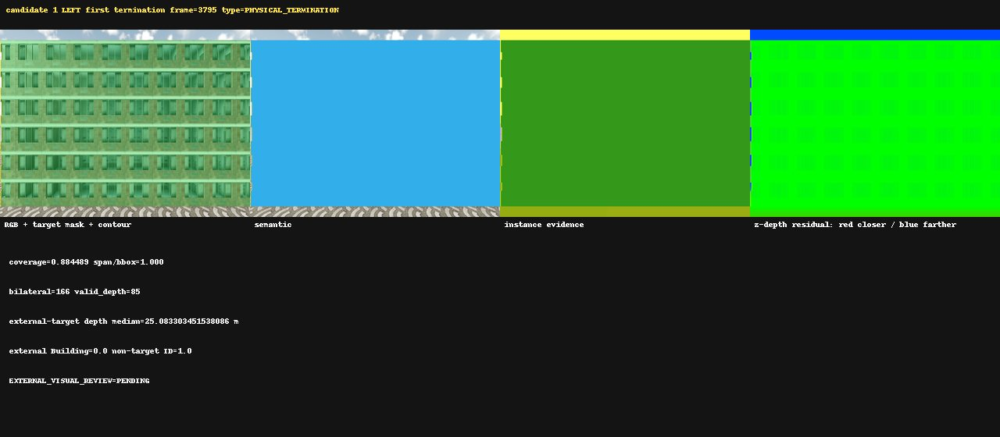
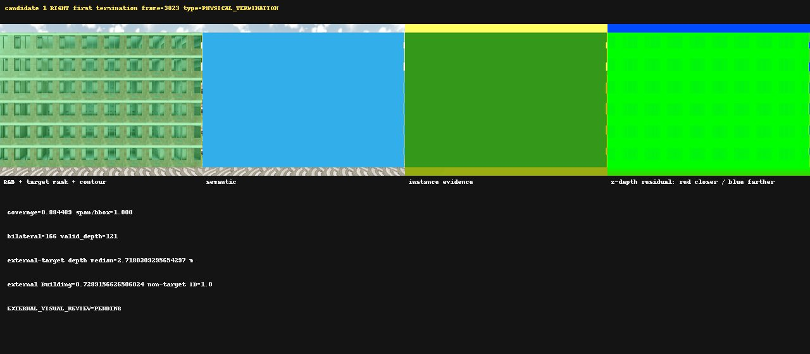

# ACT-0R2 Candidate 1 Bilateral Event Audit

This run used the checkpoint `locator_center_pose` and action axis directly.
Role names are provenance only. CARLA pixels, z-depth, K and per-frame
`T_world_camera` determine every scientific state. No rollout or JEPA training ran.

External visual review is **PENDING**.

## Gates

| Gate | Status |
| --- | --- |
| CHECKPOINT_POSE_ALIGNMENT | PASS |
| SENSOR_PAIRING | PASS |
| BILATERAL_SAME_START | PASS |
| CENTER_LEFT_BOUNDARY_ABSENT | PASS |
| CENTER_RIGHT_BOUNDARY_ABSENT | PASS |
| LEFT_EVENT_ORDERING | PASS |
| RIGHT_EVENT_ORDERING | PASS |
| LEFT_PHYSICAL_TERMINATION | PASS |
| RIGHT_PHYSICAL_TERMINATION | PASS |
| LEFT_TIER_V | PASS |
| RIGHT_TIER_V | PASS |
| SAME_POSE_CONFIRMATION | PASS |
| SAME_POSE_WORLD_BOUNDARY_REPEATABILITY | PASS |
| MULTIVIEW_REPEATABILITY | NOT_EVALUATED |
| EXTERNAL_VISUAL_REVIEW | PENDING |
| READY_FOR_NEXT_SURFACE | CONDITIONAL_PASS |
| READY_FOR_COUNTERFACTUAL_ROLLOUT | NOT_EVALUATED |
| READY_FOR_JEPA | NOT_EVALUATED |

## Runtime and raw integrity

- Persisted frames: 15 (one shared CENTER plus seven per side)
- Raw files: 106; bytes: 63257899
- Manifest payload hashes: 90 checked, PASS
- Python AS limit: 4294967296 bytes
- Python peak RSS/VMS: 297938944 / 2605555712 bytes
- CARLA peak RSS: 5405904896 bytes
- CARLA initial/effective AS limits: 17179869184 / 34359738368 bytes
- The 16 GiB CARLA launch failed during engine initialization; the bounded capture used 32 GiB. The Python limit remained 4 GiB.

## Bilateral evidence

## Per-direction summary

| Direction | Event order | Boundary | Tier V | Same-pose world spread |
| --- | --- | --- | --- | ---: |
| LEFT | PASS | PHYSICAL_TERMINATION | PASS | 0.0 m |
| RIGHT | PASS | PHYSICAL_TERMINATION | PASS | 0.0 m |

## Per-frame pixel states

| Direction | Frame | Role (provenance) | Pixel/geometric state | Coverage | Span/bbox | Boundary u |
| --- | ---: | --- | --- | ---: | ---: | ---: |
| LEFT | 3787 | INSIDE | NO_VALID_EXTERNAL_BOUNDARY | 0.887500 | 0.004695 | -16.516733 px |
| LEFT | 3791 | PRE_EDGE | APPROACH | 0.885876 | 0.431925 | -0.030396 px |
| LEFT | 3795 | STRADDLE | FIRST_PHYSICAL_TERMINATION | 0.884489 | 1.000000 | 1.000000 px |
| LEFT | 3799 | STRADDLE_REPEAT_1 | PHYSICAL_TERMINATION | 0.884489 | 1.000000 | 1.000000 px |
| LEFT | 3803 | STRADDLE_REPEAT_2 | PHYSICAL_TERMINATION | 0.884489 | 1.000000 | 1.000000 px |
| LEFT | 3807 | STRADDLE_REPEAT_3 | PHYSICAL_TERMINATION | 0.884489 | 1.000000 | 1.000000 px |
| LEFT | 3811 | POST_EDGE | PHYSICAL_TERMINATION | 0.861449 | 1.000000 | 18.776299 px |
| RIGHT | 3815 | INSIDE | NO_VALID_EXTERNAL_BOUNDARY | 0.887500 | 0.004695 | 655.516868 px |
| RIGHT | 3819 | PRE_EDGE | APPROACH | 0.885876 | 0.431925 | 639.030404 px |
| RIGHT | 3823 | STRADDLE | FIRST_PHYSICAL_TERMINATION | 0.884489 | 1.000000 | 638.000000 px |
| RIGHT | 3827 | STRADDLE_REPEAT_1 | PHYSICAL_TERMINATION | 0.884489 | 1.000000 | 638.000000 px |
| RIGHT | 3831 | STRADDLE_REPEAT_2 | PHYSICAL_TERMINATION | 0.884489 | 1.000000 | 638.000000 px |
| RIGHT | 3835 | STRADDLE_REPEAT_3 | PHYSICAL_TERMINATION | 0.884489 | 1.000000 | 638.000000 px |
| RIGHT | 3839 | POST_EDGE | PHYSICAL_TERMINATION | 0.861442 | 1.000000 | 620.221877 px |

Same-pose spread is not multiview repeatability.
`MULTIVIEW_REPEATABILITY` remains `NOT_EVALUATED`.

The first offline pass labeled weak partial contours UNKNOWN before applying the
unchanged Tier V threshold and world-line projection. The corrected precedence
maps a two-pixel far-outside contour to NO_VALID_EXTERNAL_BOUNDARY and the
partial near-outside contour to APPROACH. No threshold or raw frame changed.
