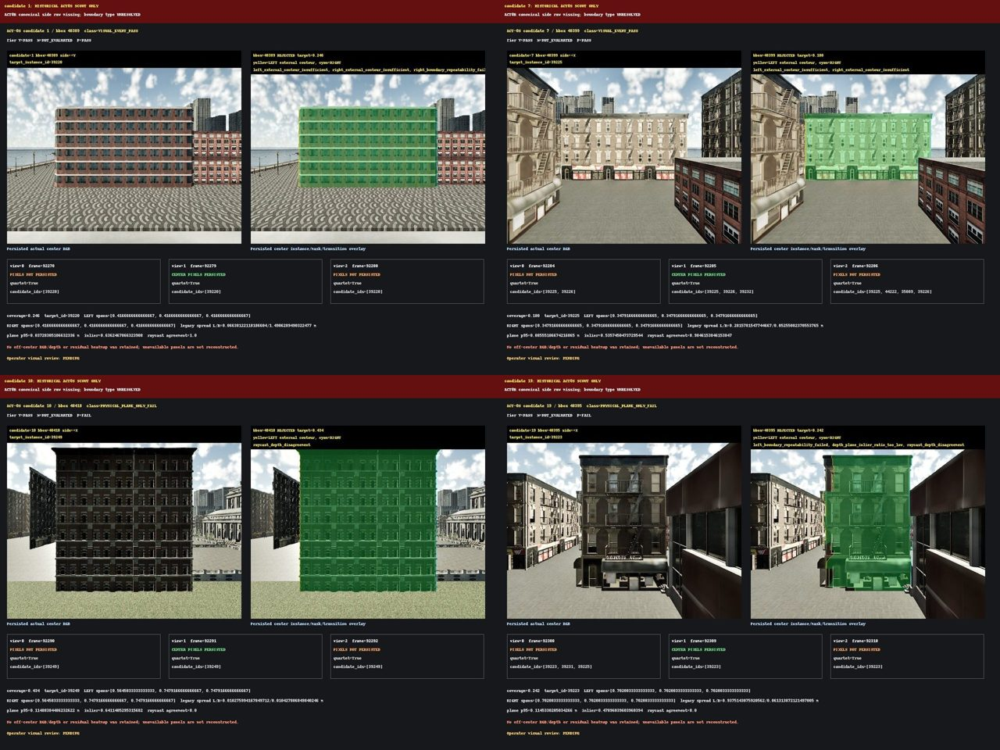
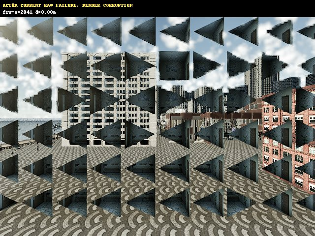
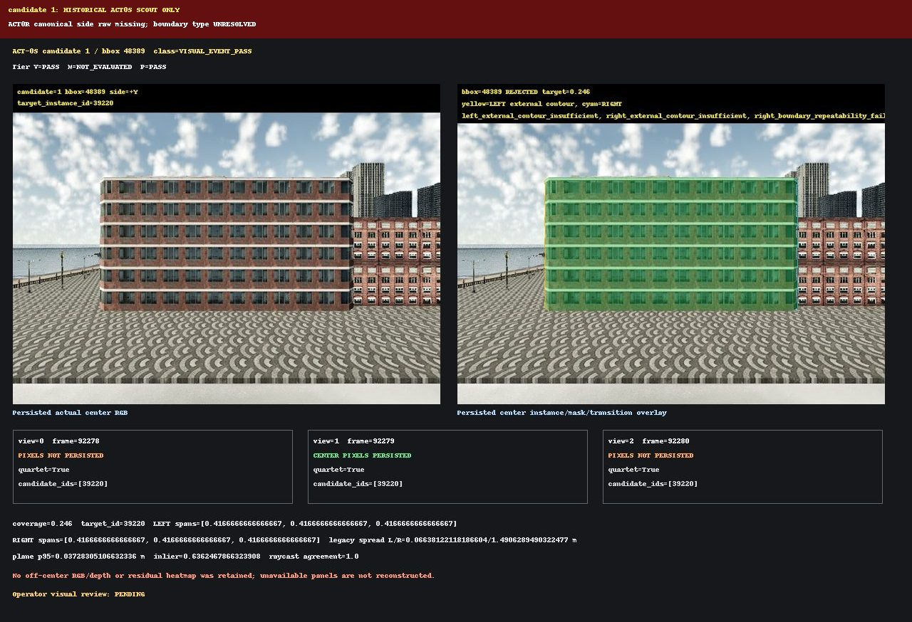
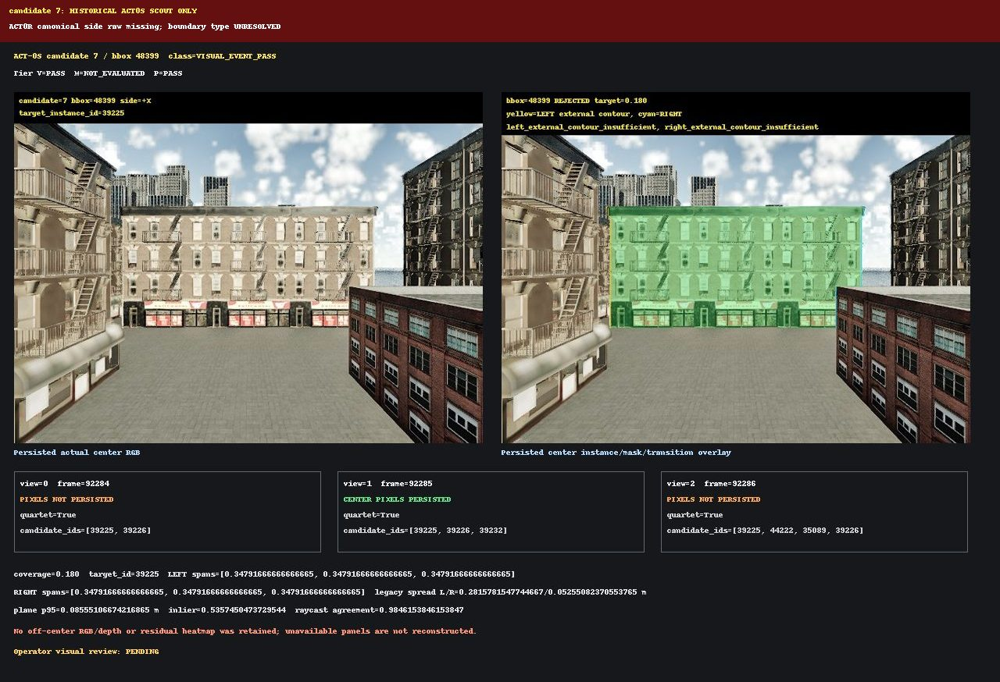
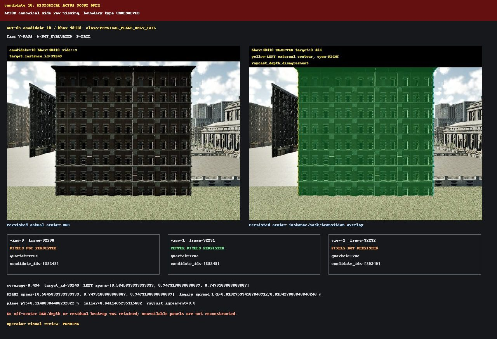
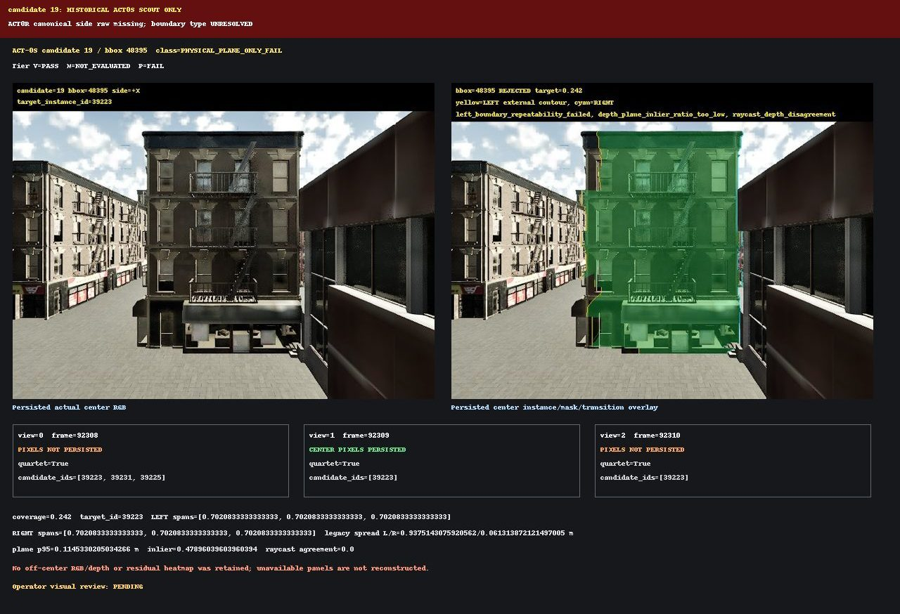

# ACT-0R Visual Audit

ACT-0R is an incomplete capture, not a successful boundary audit. The bounded instance-only locator found bilateral candidate events for all four requested candidates, but the canonical RGB/depth/semantic/instance rig did not complete its first requested side frame within the 1200-second client limit. Locator events are acquisition positions only; they are not physical-boundary labels.

## Gates

| Gate | Status | Evidence |
|---|---|---|
| SENSOR_QUADRUPLET_PAIRING | FAIL | available_frames=1, available_frames_paired=1, expected_frames=60, available_pairing_valid=True, available_rgb_visual_integrity=FAIL, visual_integrity_reason=candidate 1 CENTER RGB has severe repeated triangular geometry/tiling artifacts |
| RAW_PIXEL_EVIDENCE_AVAILABLE | FAIL | available_frames=1, expected_frames=60, raw_path=results/act0r/raw, raw_size_bytes=3116843 |
| CONFIG_OUTCOME_OVERRIDE_ABSENT | PASS | forbidden_paths=[], forbidden_keys=['candidate_classification', 'classification', 'existing_evidence_interpretation', 'expected_boundary_type', 'force_pass', 'override', 'tier_v_status'] |
| TARGET_INSTANCE_STABILITY | FAIL | stable_candidates=0, required=4, reason=bilateral canonical frames missing |
| BILATERAL_BOUNDARY_OBSERVED | FAIL | candidate_count=0, required=4 |
| BOUNDARY_TYPE_RESOLVED | FAIL | resolved_sides=0, required_sides=8 |
| PHYSICAL_TERMINATION_COUNT | FAIL | termination_sides=0, bilateral_eligible_surfaces=0 |
| TIER_V_RECOMPUTED_FROM_PIXELS | FAIL | recomputed_sides=0, required_sides=8, uses_act0s_outcomes=False |
| OFFICIAL_TIER_M | FAIL | evaluated_sides=0, required_sides=8, uses_plane=False, uses_bbox=False, absolute_accuracy=NOT_EVALUATED |
| SAME_POSE_CONFIRMATION | FAIL | confirmed_sides=0, required_sides=8 |
| PUBLIC_VISUAL_EVIDENCE | FAIL | image_count=7, reason=current LEFT/RIGHT canonical images are missing |
| OPERATOR_VISUAL_REVIEW | PENDING |  |
| READY_FOR_COUNTERFACTUAL_ROLLOUT | FAIL | eligible_surfaces=0, required=4 |
| READY_FOR_DATASET_EXPANSION | NOT_EVALUATED |  |
| READY_FOR_JEPA | NOT_EVALUATED |  |

## Candidate directions

| Candidate | bbox | Direction | Locator event (m) | Boundary type | Tier V | Tier M |
|---:|---:|---|---:|---|---|---|
| 1 | 48389 | LEFT | 4.0625 | UNRESOLVED | NOT_EVALUATED | NOT_EVALUATED |
| 1 | 48389 | RIGHT | 4.0625 | UNRESOLVED | NOT_EVALUATED | NOT_EVALUATED |
| 7 | 48399 | LEFT | 1.4375 | UNRESOLVED | NOT_EVALUATED | NOT_EVALUATED |
| 7 | 48399 | RIGHT | 1.4375 | UNRESOLVED | NOT_EVALUATED | NOT_EVALUATED |
| 10 | 48418 | LEFT | 2.4375 | UNRESOLVED | NOT_EVALUATED | NOT_EVALUATED |
| 10 | 48418 | RIGHT | 2.4375 | UNRESOLVED | NOT_EVALUATED | NOT_EVALUATED |
| 19 | 48395 | LEFT | 0.0625 | UNRESOLVED | NOT_EVALUATED | NOT_EVALUATED |
| 19 | 48395 | RIGHT | 0.0625 | UNRESOLVED | NOT_EVALUATED | NOT_EVALUATED |

## Available current raw

- Persisted canonical quartets: 1 / 60.
- Persisted raw size: 3116843 bytes.
- The available candidate 1 CENTER quartet has matching frame IDs/timestamps and verified file hashes, but its RGB visibly contains severe repeated triangular geometry/tiling artifacts. It is capture-failure evidence, not usable facade imagery. One corrupted CENTER frame cannot establish instance stability, boundary type, Tier V, Tier M, or same-pose repeatability.

## Historical scout context

The following are real ACT-0S three-view scout images, not ACT-0R side captures. They are included only to expose the four attempted candidates and the missing-evidence failure.

## Candidate 19 right side

No current RIGHT depth/semantic/instance quartet exists, so the suspected obstruction remains UNRESOLVED. Operator visual review remains PENDING. No counterfactual rollout, dataset expansion, model download, or JEPA training was run.
