# ACT-0S Screening Definition and Public Evidence Audit

ACT-0S reclassifies the existing 12 candidates and 36 synchronized scout quartets. It did not start CARLA, recapture scout views, run a counterfactual rollout, download a model, or train JEPA. The historical full physical gate remains 0/12.

## Evidence limitation

The scout persisted all frame/timestamp/pose metadata but only the center RGB and center instance overlay for each candidate. Off-center RGB/depth/semantic/instance arrays and residual heatmaps were not saved. The candidate sheets below show the real persisted center evidence and label the missing views explicitly; they are not reconstructed. Consequently `PUBLIC_ACT0_EVIDENCE` is FAIL and official Tier M is NOT_EVALUATED.

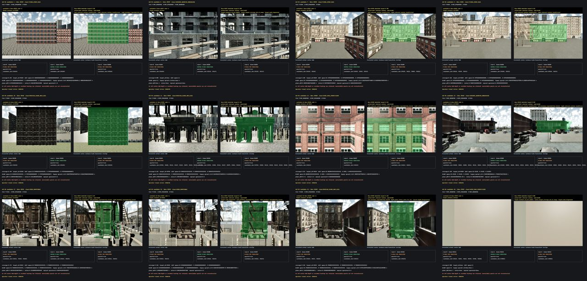

## Gates

| Gate | Status | Evidence |
|---|---|---|
| PUBLIC_ACT0_EVIDENCE | FAIL | only center-view pixels were persisted; 24 off-center views and residual heatmaps are unavailable |
| SCOUT_SENSOR_PAIRING | PASS | paired_quartets=36, quartets=36 |
| SCOUT_POSE_COVERAGE | FAIL | insufficient_candidates=2 |
| SCREENING_DEFINITION_VALID | PASS | tier_p_can_veto_tier_v=False, not_observed_counted_as_scene_fail=False |
| VISUAL_EVENT_SURFACE_COUNT | PASS | count=6, required=4, scope=geometry-reference classification pending operator review |
| METRIC_REPEATABLE_SURFACE_COUNT | NOT_EVALUATED | verified_count=0, evaluable_count=0, legacy_proxy_sensitivity_counts={'0.05m': 3, '0.10m': 6, '0.25m': 6, '1.00m': 8} |
| PHYSICAL_PLANE_SURFACE_COUNT | FAIL | count=3, required=4 |
| INSTANCE_GROUPING_RESOLVED | FAIL | unresolved_candidates=2 |
| READY_FOR_ADAPTIVE_RESCOUT | CONDITIONAL_PASS | targeted boundary-view recapture can address pose/evidence gaps without changing historical gates |
| READY_FOR_COUNTERFACTUAL_ROLLOUT | FAIL | official Tier M and complete public three-view evidence are unavailable |
| READY_FOR_DATASET_EXPANSION | NOT_EVALUATED |  |
| READY_FOR_JEPA | NOT_EVALUATED |  |
| OPERATOR_VISUAL_REVIEW | PENDING |  |

## Tier definitions

- Tier V uses quartet pairing, Building-semantic target provenance, selected-instance stability, the retained component pass/fail bit, and multi-view target/non-target transition summaries. It does not use plane or raycast metrics.
- Tier M requires target-side contour pixels, z-depth, K, per-frame `T_world_camera`, and a camera-motion action axis. Those raw inputs were not persisted. Historical plane-basis spreads appear only as non-gating sensitivity proxies.
- Tier P retains the original strict plane residual, normal, inlier, raycast/depth, and physical-width checks. Tier P does not overwrite Tier V.

## Candidate matrix

| Candidate | bbox | Classification | Tier V | Tier M | Tier P | Rationale |
|---:|---:|---|---|---|---|---|
| 1 | 48389 | VISUAL_EVENT_PASS | PASS | NOT_EVALUATED | PASS | Both exterior transitions persist across three views; strict plane gate passes, while RIGHT legacy spread is not used by Tier V. |
| 6 | 48397 | INSTANCE_GROUPING_UNRESOLVED | NOT_OBSERVED | NOT_EVALUATED | NOT_OBSERVED | Candidate IDs change from 39220 to 35115/35117 and no single target instance survives all three views. |
| 7 | 48399 | VISUAL_EVENT_PASS | PASS | NOT_EVALUATED | PASS | Selected instance 39225 and its bilateral exterior transitions persist; neighboring stable IDs are recorded but not merged. |
| 8 | 48401 | VISUAL_EVENT_PASS | PASS | NOT_EVALUATED | PASS | Selected instance 39226 has stable bilateral transitions and the strict physical-plane gate passes. |
| 10 | 48418 | PHYSICAL_PLANE_ONLY_FAIL | PASS | NOT_EVALUATED | FAIL | Visual contours and selected instance are stable, but raycast/depth agreement is zero. |
| 11 | 48436 | PHYSICAL_PLANE_ONLY_FAIL | PASS | NOT_EVALUATED | FAIL | Selected instance 39766 has stable contours, but plane inlier ratio and raycast/depth agreement fail Tier P. |
| 12 | 48420 | SCOUT_POSE_INSUFFICIENT | NOT_OBSERVED | NOT_EVALUATED | FAIL | Only the right termination is visible in the center image and contour span changes 0.002/0.662/0.083 across offsets. |
| 13 | 48419 | INSTANCE_GROUPING_UNRESOLVED | NOT_OBSERVED | NOT_EVALUATED | FAIL | Eight stable candidate IDs occupy the scout crop; the retained compact evidence cannot prove which meshes form one facade. |
| 17 | 48391 | SCENE_UNSUITABLE | FAIL | NOT_EVALUATED | FAIL | Target mask fragmentation and visible fire-escape/foreground structure prevent a clean facade event. |
| 18 | 48393 | SCENE_UNSUITABLE | FAIL | NOT_EVALUATED | FAIL | Target mask fragmentation and visible fire-escape/foreground structure prevent a clean facade event. |
| 19 | 48395 | PHYSICAL_PLANE_ONLY_FAIL | PASS | NOT_EVALUATED | FAIL | Selected instance and exterior contours persist, but plane inlier ratio and raycast/depth agreement fail Tier P. |
| 20 | 47839 | SCOUT_POSE_INSUFFICIENT | NOT_OBSERVED | NOT_EVALUATED | NOT_OBSERVED | The persisted center RGB faces a blank near wall and no target instance remains stable across the three offsets. |

## Candidate evidence

### Candidate 1 / bbox 48389

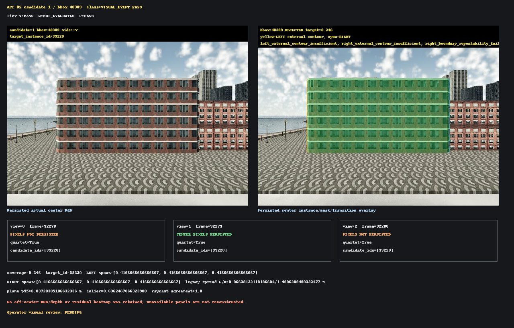

### Candidate 6 / bbox 48397

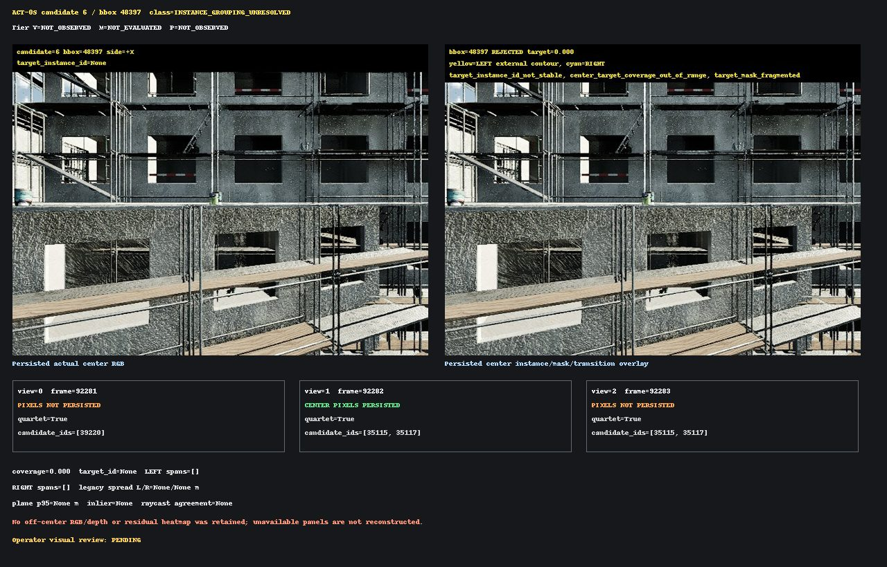

### Candidate 7 / bbox 48399

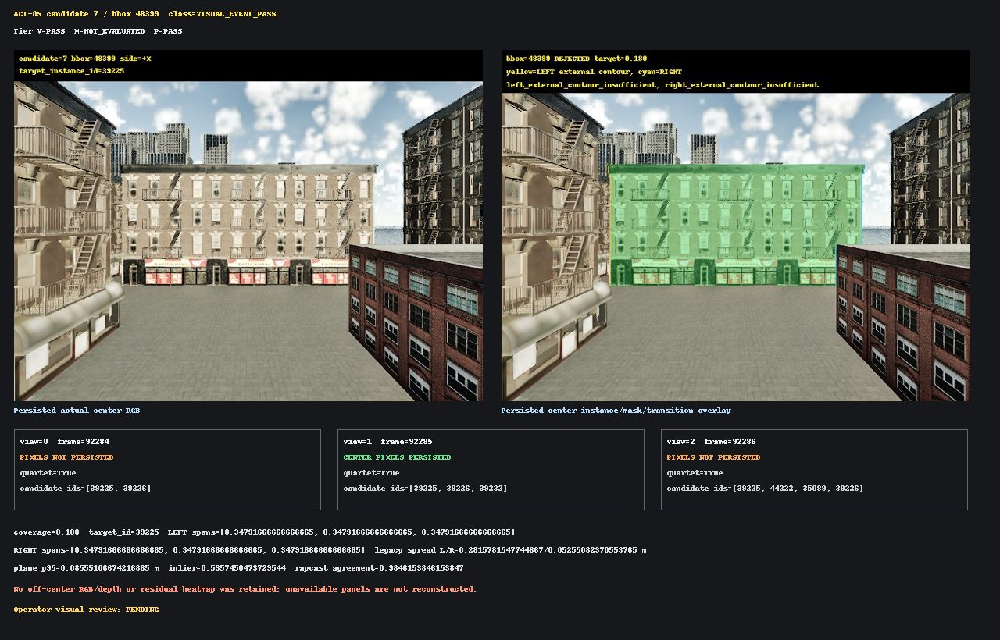

### Candidate 8 / bbox 48401

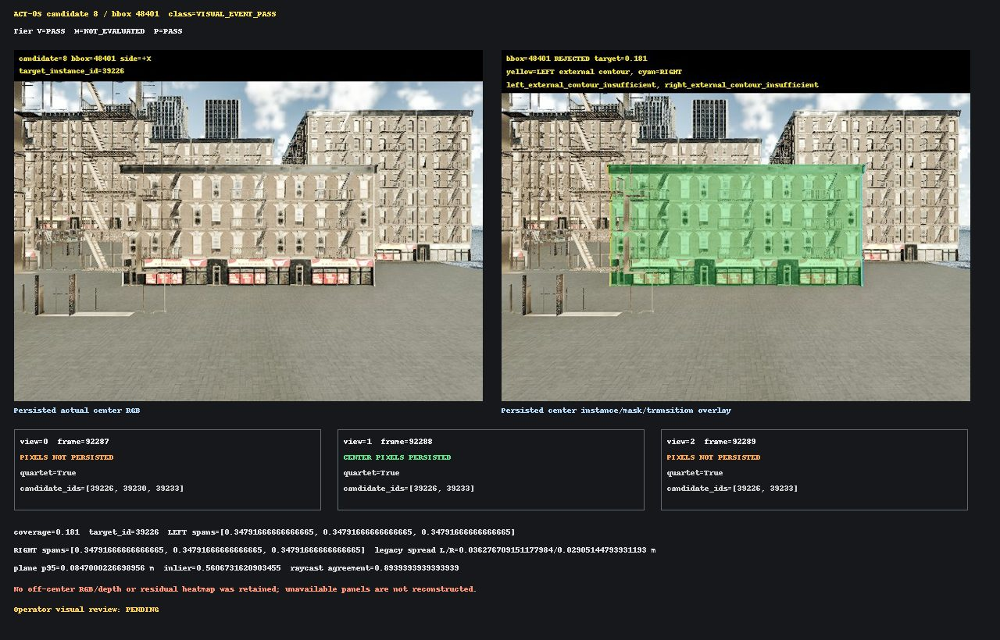

### Candidate 10 / bbox 48418

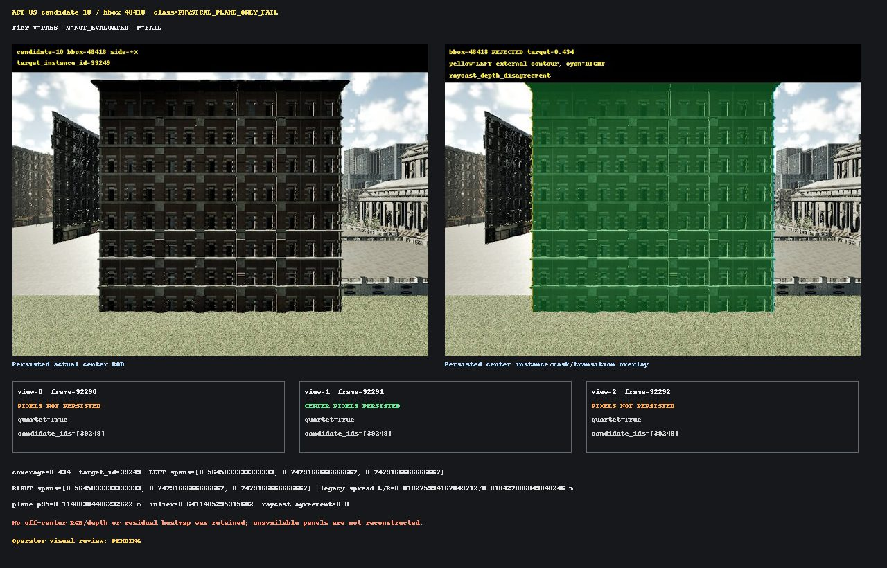

### Candidate 11 / bbox 48436

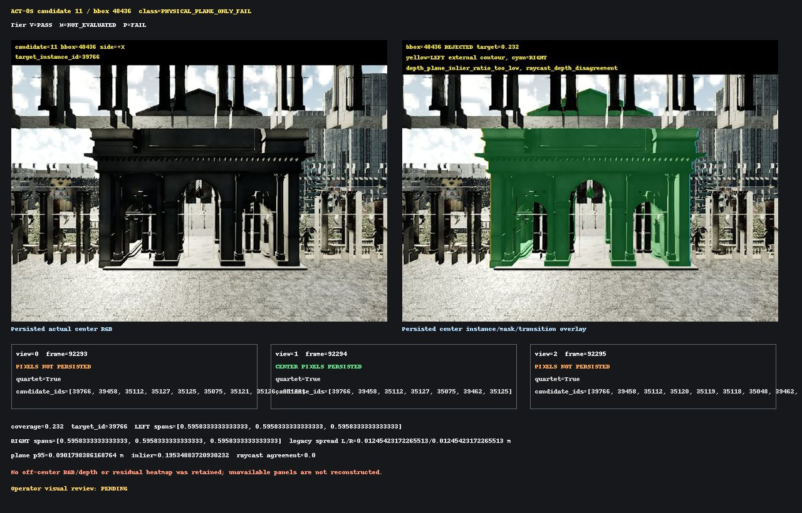

### Candidate 12 / bbox 48420

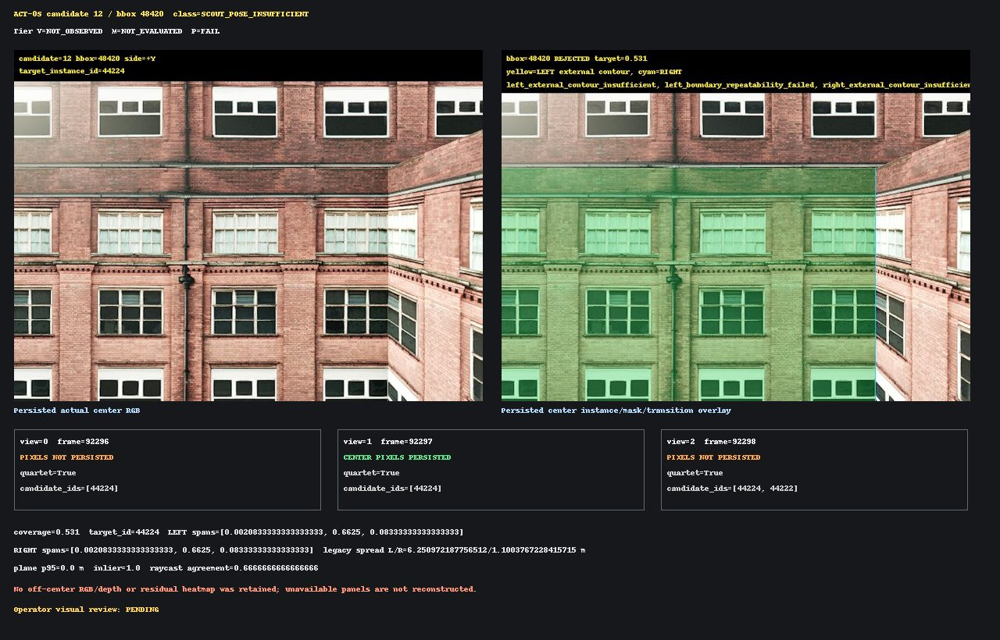

### Candidate 13 / bbox 48419

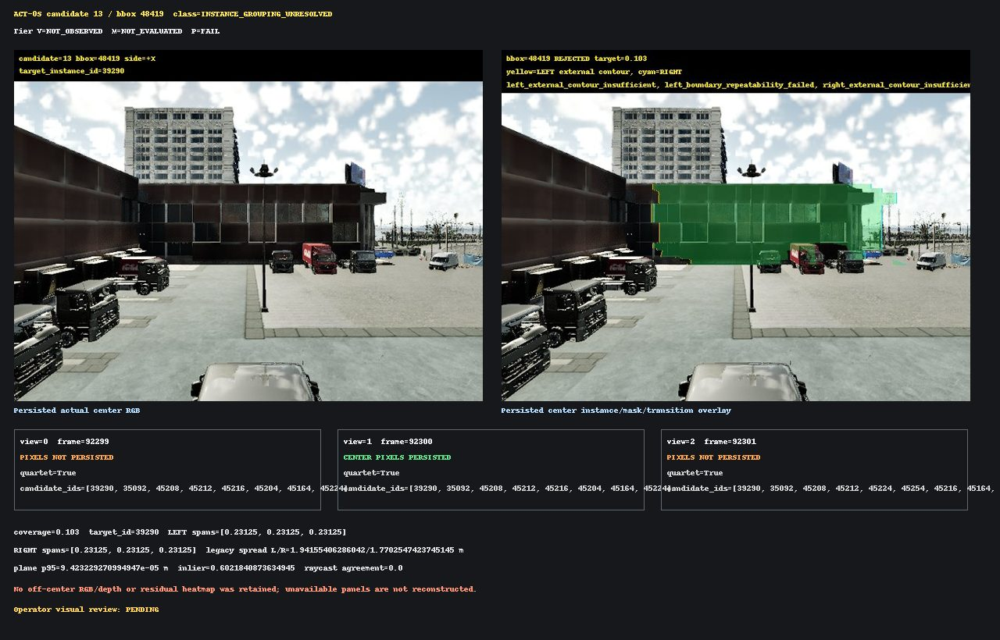

### Candidate 17 / bbox 48391

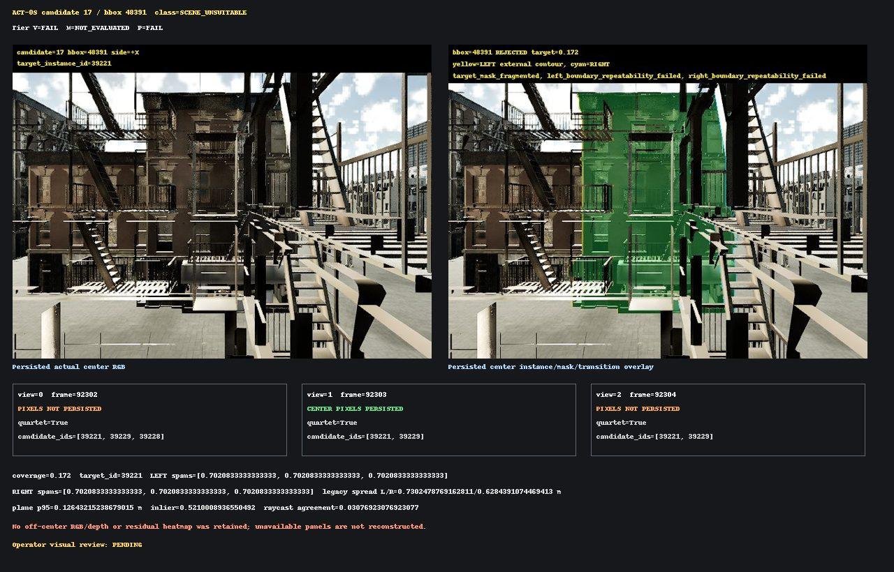

### Candidate 18 / bbox 48393

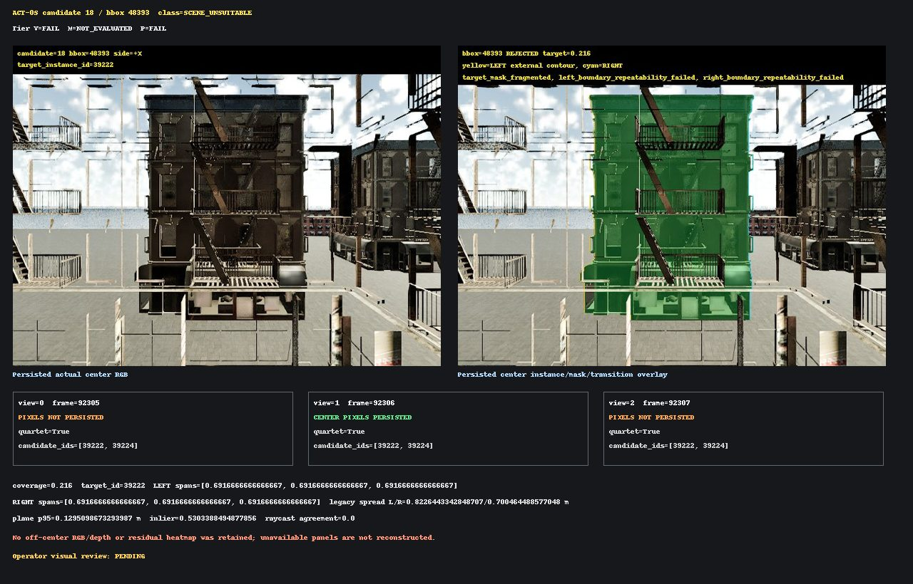

### Candidate 19 / bbox 48395

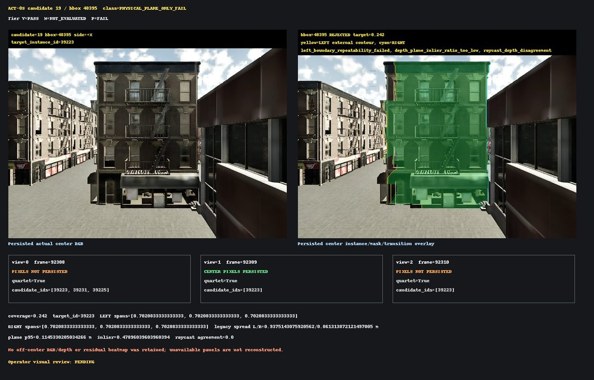

### Candidate 20 / bbox 47839

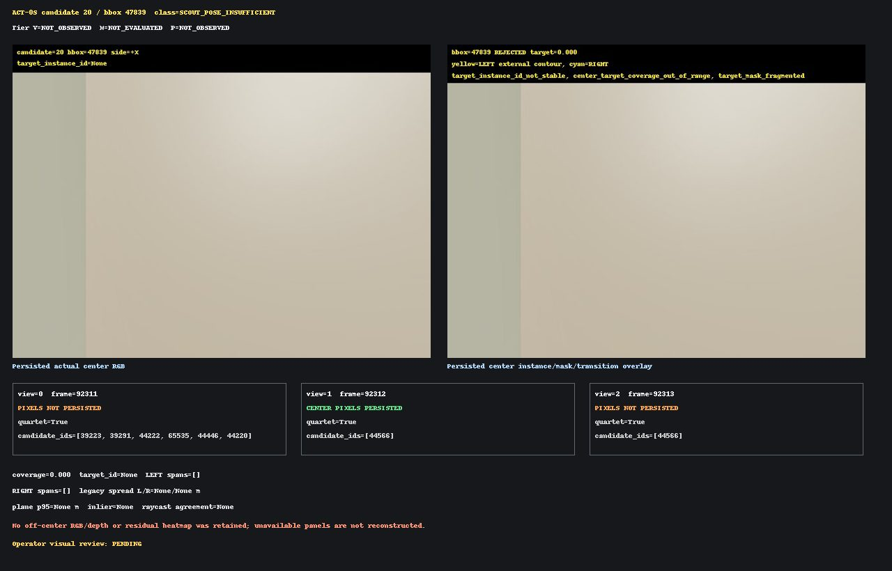

## Requested examples

- `SCOUT_POSE_INSUFFICIENT`: candidates 12 and 20.
- `PHYSICAL_PLANE_ONLY_FAIL`: candidates 10, 11, and 19.
- Instance fragmentation / `SCENE_UNSUITABLE`: candidates 17 and 18.
- Confirmed `SCENE_UNSUITABLE`: candidates 17 and 18 under compact geometry-reference evidence; external operator review remains pending.

## Decision

The next permissible experiment is a small adaptive rescout that persists the missing boundary-side pixels and plane-free Tier M inputs. A map or asset replacement is not yet required because six candidates pass Tier V under the compact geometry reference, but counterfactual rollout is not authorized by this audit.
