# ACT-0 Visual Audit

ACT-0 stopped at facade screening. The required four independent facades with reliable LEFT/RIGHT external boundaries were not available under the fixed scout gates. No counterfactual rollout or JEPA training was run.

## Outcome

```text
candidate facades screened: 12
automatically valid facades: 0
required valid facades: 4
counterfactual trajectories: 0
operator visual review: PENDING
READY_FOR_DATASET_EXPANSION: FAIL
READY_FOR_JEPA: NOT_EVALUATED
```

The scout used three synchronized RGB/depth/semantic/instance views per candidate. Bboxes seeded camera poses only. Physical-boundary evidence came from stable instance IDs, exterior contours, z-depth backprojection and raycast comparison.

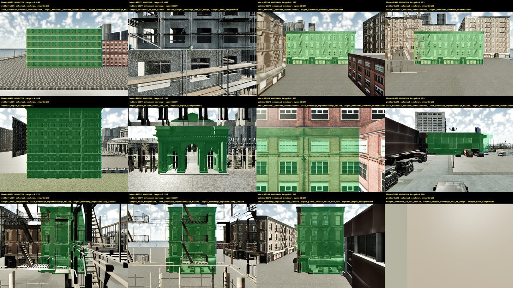

## Gates

| Gate | Status | Evidence |
|---|---|---|
| PHASE_A_PREREQUISITES | PASS | required_gates=['HISTORY_BOUNDARY_LEAKAGE_FIXED', 'TRAIN_ONLY_PREPROCESSING', 'SYNTHETIC_ALIGNMENT_TEST', 'OBS0R1_REPRODUCIBILITY'] |
| COUNTERFACTUAL_START_MATCH | NOT_EVALUATED | no rollout started |
| SENSOR_PAIRING | PASS | scout_quartets=36, paired_quartets=36, scope=low-cost facade scout only |
| INSTANCE_ID_STABILITY | PASS | stable_candidates=10, required_candidates=4 |
| VALID_EXTERNAL_BOUNDARY | FAIL | selected_surfaces=0, required_surfaces=4 |
| FIRST_STRADDLE_STOP | NOT_EVALUATED | stopped after facade screening |
| SAME_POSE_CONFIRMATION | NOT_EVALUATED | stopped after facade screening |
| FIXED_SCHEDULE_SHORTCUT_BROKEN | NOT_EVALUATED | no ACT-0 rollout labels |
| MULTI_SURFACE_SPLIT_VALID | FAIL | surface_count=0, required_surfaces=4 |
| COUNTERFACTUAL_EVENT_COVERAGE | FAIL | trajectory_count=0, paired_start_count=0 |
| RGB_INCREMENTAL_VALUE_OVER_ODOMETRY | NOT_EVALUATED | no cross-surface ACT-0 rollout data |
| ACTION_SELECTION_OBSERVABILITY | NOT_EVALUATED | no counterfactual outcome pairs |
| OPERATOR_VISUAL_REVIEW | PENDING | candidate_images=12 |
| READY_FOR_DATASET_EXPANSION | FAIL | fewer than four valid facades |
| READY_FOR_JEPA | NOT_EVALUATED |  |

## Candidates

| Index | bbox | Decision | Target coverage | Stable ID | Raycast agreement | Rejection reasons |
|---:|---:|---|---:|---|---:|---|
| 1 | 48389 | REJECTED | 0.246 | True | 1.000 | left_external_contour_insufficient, right_external_contour_insufficient, right_boundary_repeatability_failed |
| 6 | 48397 | REJECTED | 0.000 | False | n/a | target_instance_id_not_stable, center_target_coverage_out_of_range, target_mask_fragmented, left_external_contour_insufficient, left_world_boundary_insufficient, left_boundary_repeatability_failed, right_external_contour_insufficient, right_world_boundary_insufficient, right_boundary_repeatability_failed, depth_plane_residual_too_large, depth_plane_normal_inconsistent, depth_plane_inlier_ratio_too_low, raycast_evidence_missing, terminal_width_too_small_or_degenerate |
| 7 | 48399 | REJECTED | 0.180 | True | 0.985 | left_external_contour_insufficient, right_external_contour_insufficient |
| 8 | 48401 | REJECTED | 0.181 | True | 0.894 | left_external_contour_insufficient, right_external_contour_insufficient |
| 10 | 48418 | REJECTED | 0.434 | True | 0.000 | raycast_depth_disagreement |
| 11 | 48436 | REJECTED | 0.232 | True | 0.000 | depth_plane_inlier_ratio_too_low, raycast_depth_disagreement |
| 12 | 48420 | REJECTED | 0.531 | True | 0.667 | left_external_contour_insufficient, left_boundary_repeatability_failed, right_external_contour_insufficient, right_boundary_repeatability_failed, raycast_depth_disagreement, terminal_width_too_small_or_degenerate |
| 13 | 48419 | REJECTED | 0.103 | True | 0.000 | left_external_contour_insufficient, left_boundary_repeatability_failed, right_external_contour_insufficient, right_boundary_repeatability_failed, raycast_depth_disagreement |
| 17 | 48391 | REJECTED | 0.172 | True | 0.031 | target_mask_fragmented, left_boundary_repeatability_failed, right_boundary_repeatability_failed, raycast_depth_disagreement |
| 18 | 48393 | REJECTED | 0.216 | True | 0.000 | target_mask_fragmented, left_boundary_repeatability_failed, right_boundary_repeatability_failed, raycast_depth_disagreement |
| 19 | 48395 | REJECTED | 0.242 | True | 0.000 | left_boundary_repeatability_failed, depth_plane_inlier_ratio_too_low, raycast_depth_disagreement |
| 20 | 47839 | REJECTED | 0.000 | False | n/a | target_instance_id_not_stable, center_target_coverage_out_of_range, target_mask_fragmented, left_external_contour_insufficient, left_world_boundary_insufficient, left_boundary_repeatability_failed, right_external_contour_insufficient, right_world_boundary_insufficient, right_boundary_repeatability_failed, depth_plane_residual_too_large, depth_plane_normal_inconsistent, depth_plane_inlier_ratio_too_low, raycast_evidence_missing, terminal_width_too_small_or_degenerate |

## Candidate images

### Candidate 1 / bbox 48389

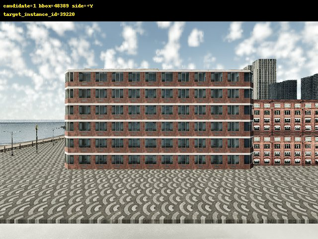
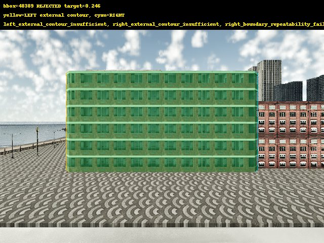

### Candidate 6 / bbox 48397

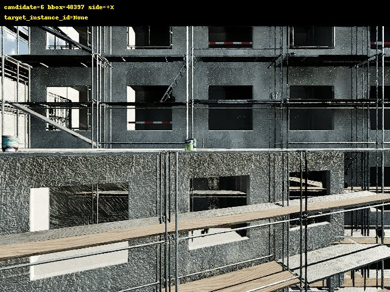
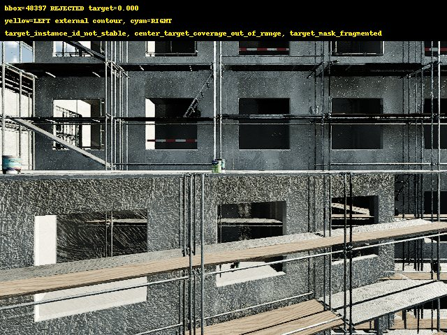

### Candidate 7 / bbox 48399

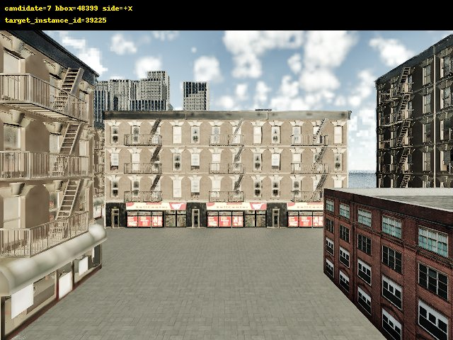
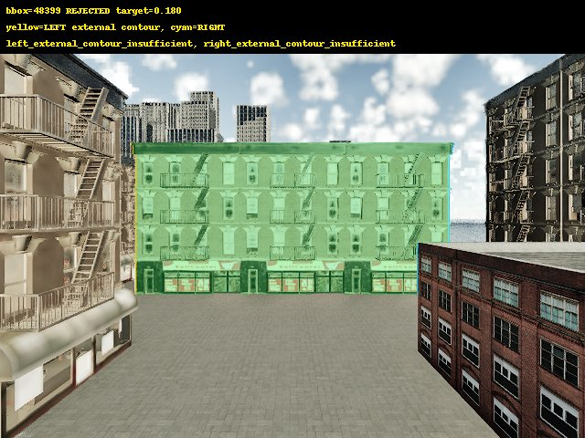

### Candidate 8 / bbox 48401

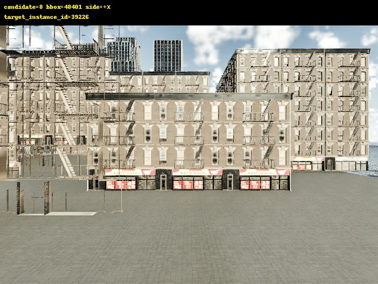
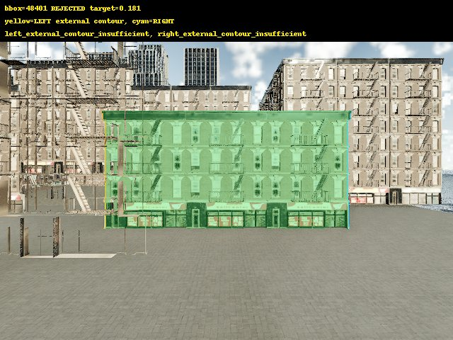

### Candidate 10 / bbox 48418

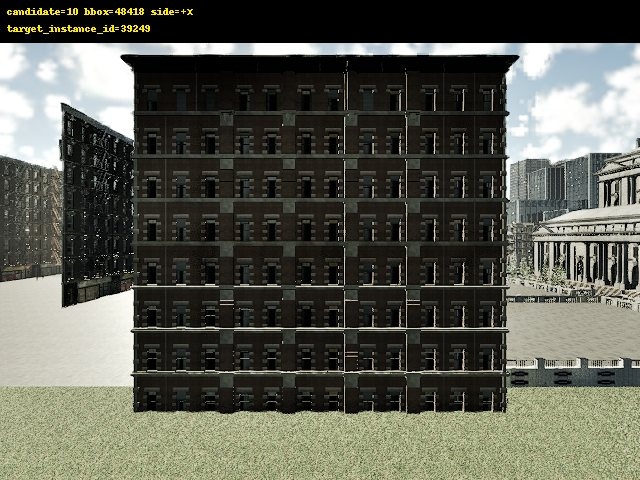
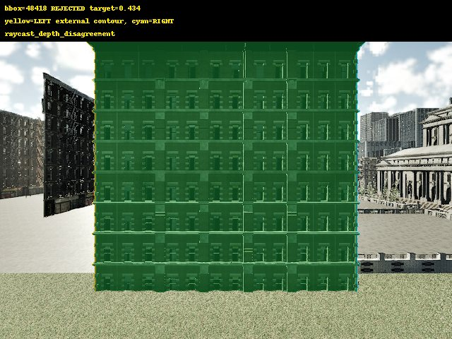

### Candidate 11 / bbox 48436

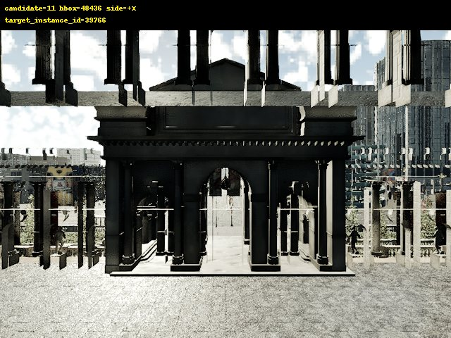
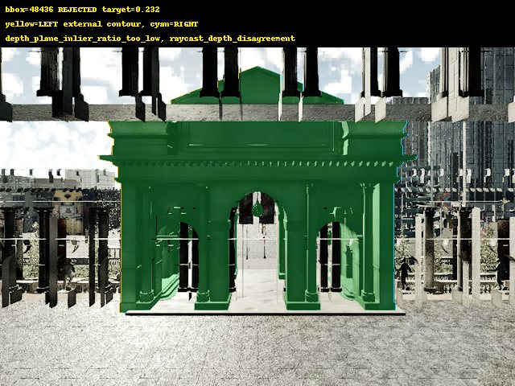

### Candidate 12 / bbox 48420

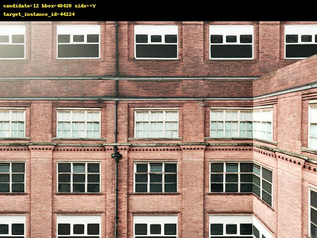
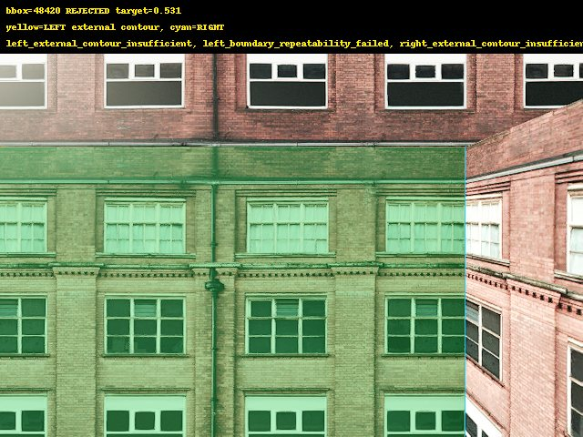

### Candidate 13 / bbox 48419

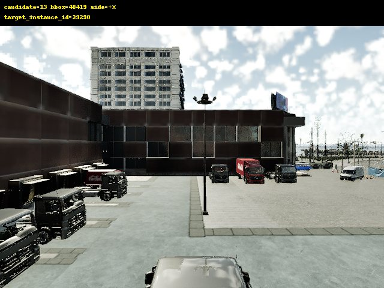
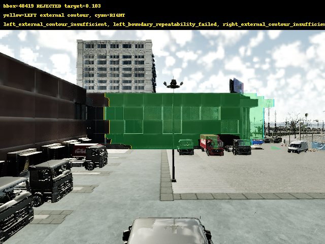

### Candidate 17 / bbox 48391

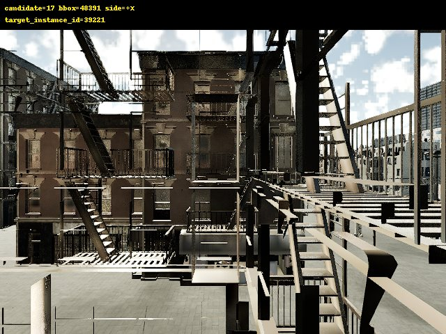
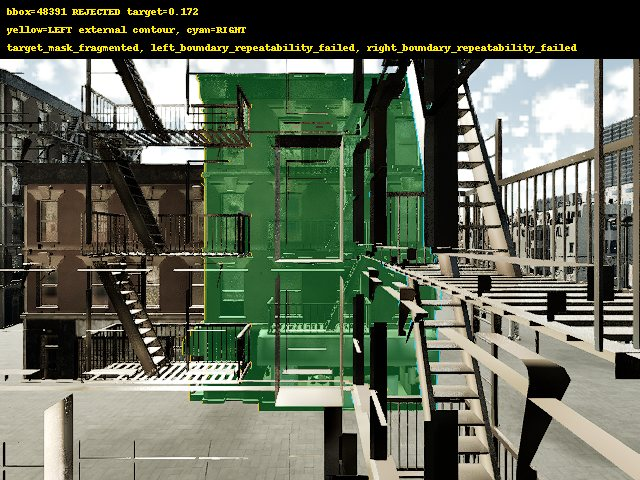

### Candidate 18 / bbox 48393

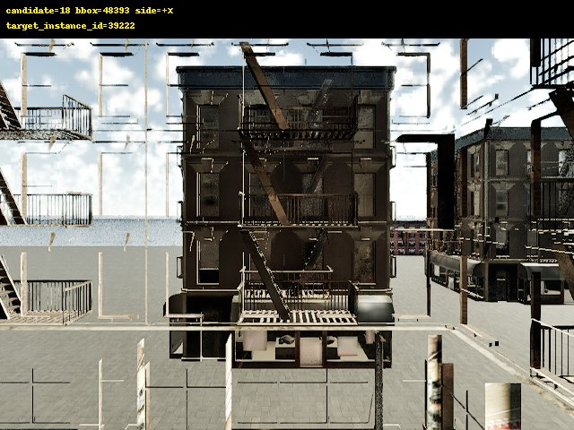
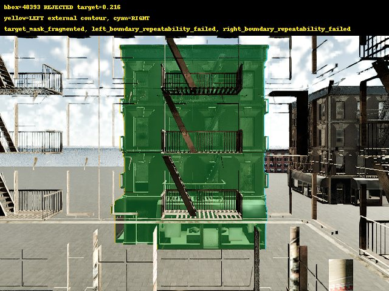

### Candidate 19 / bbox 48395

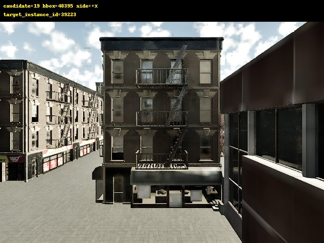
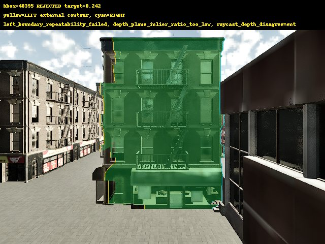

### Candidate 20 / bbox 47839

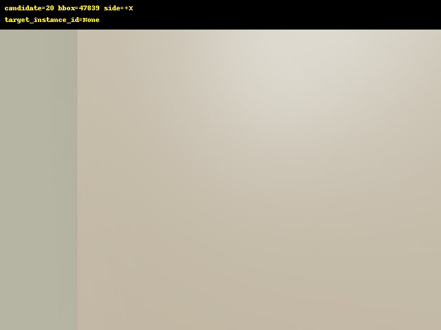
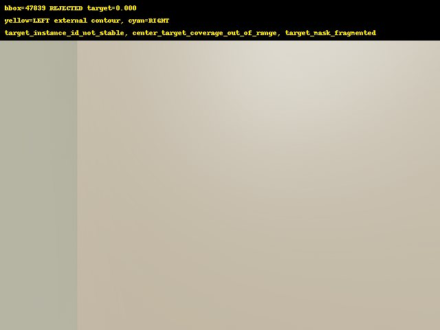

## Missing rollout artifacts

The task requires immediate stop when fewer than four facades pass screening. Therefore LEFT/RIGHT initial pairs, rollout contact sheets, first-STRADDLE frames, frozen confirmations, outcome distributions and leave-one-surface-out plots do not exist. They are not fabricated or replaced with scout images.

Instance, semantic, depth and raycast evidence was used only for privileged screening. It is not an RGB probe input.
