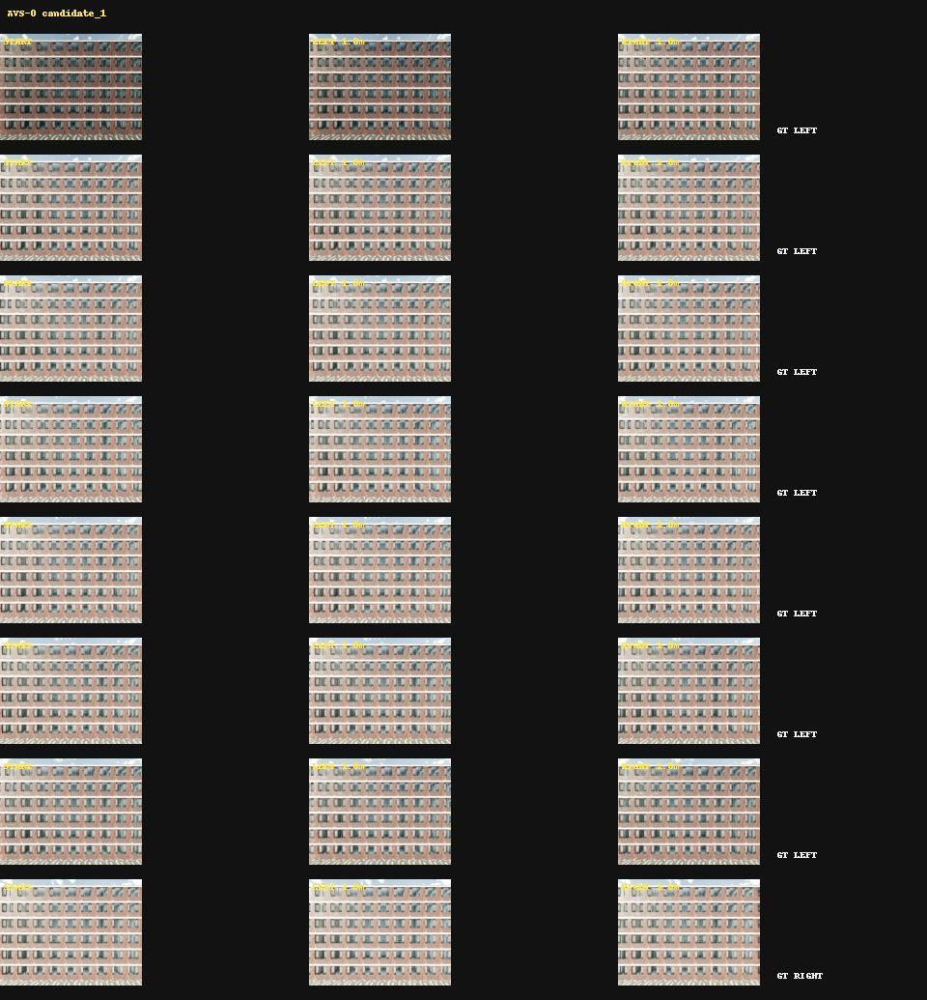
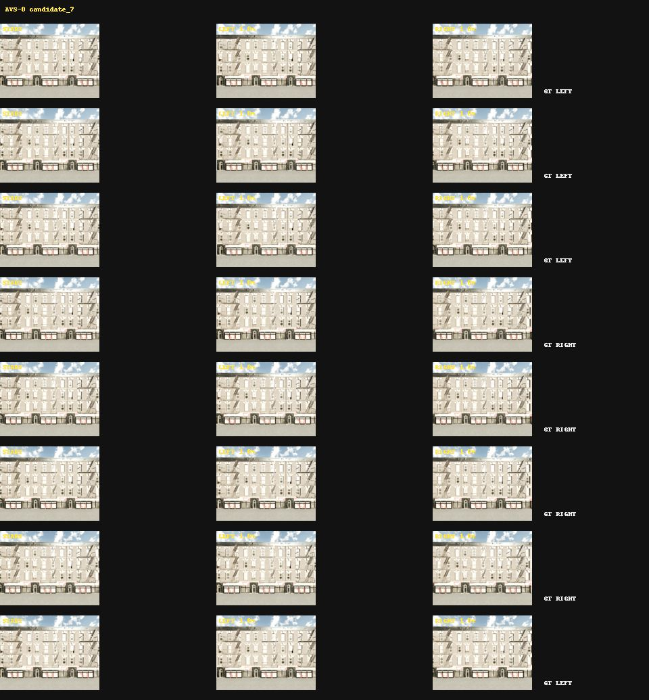
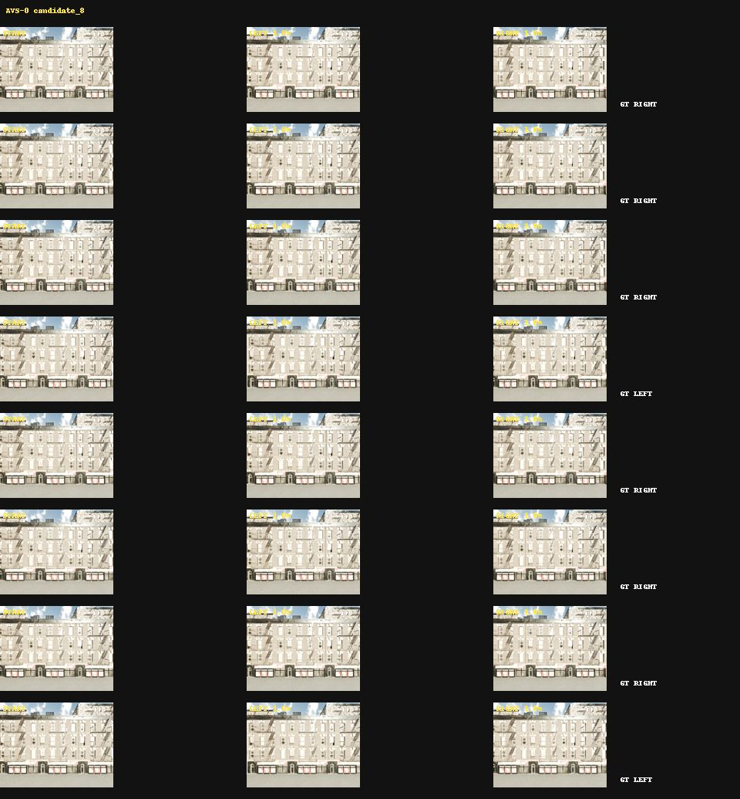
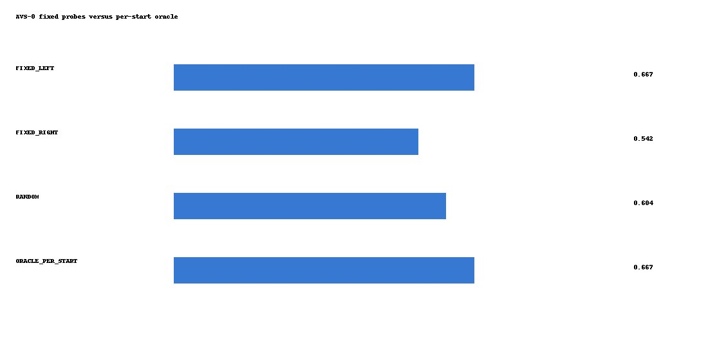
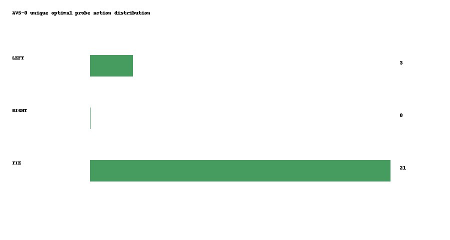

# AVS-0 Active View Selection Audit

AVS-0 is a cross-surface feasibility audit, not a trained active policy and not
a JEPA experiment. New surfaces were qualified in fixed order before endpoint
RGB results were computed. E1 uses only the 64-D endpoint RGB descriptor and
probe action. PCA and ridge are fitted on training surfaces only.

## Results

| Policy | Accuracy |
| --- | ---: |
| FIXED_LEFT | 0.666667 |
| FIXED_RIGHT | 0.541667 |
| RANDOM | 0.604167 |
| ORACLE_PER_START | 0.666667 |

- Best fixed: FIXED_LEFT (0.666667)
- Oracle minus best fixed: 0.000000
- Bootstrap 95% CI: [0.000000, 0.000000]
- ACTIVE_VIEW_SELECTION_HEADROOM: FAIL
- SENSOR_QUADRUPLET_PAIRING: PASS
- READY_FOR_POLICY_PILOT: FAIL
- READY_FOR_JEPA: NOT_EVALUATED

## Per-Surface Policy Accuracy

| Surface | Fixed LEFT | Fixed RIGHT | Oracle | Oracle-best fixed |
| --- | ---: | ---: | ---: | ---: |
| candidate_1 | 0.250000 | 0.125000 | 0.250000 | 0.000000 |
| candidate_7 | 0.750000 | 0.500000 | 0.750000 | 0.000000 |
| candidate_8 | 1.000000 | 1.000000 | 1.000000 | 0.000000 |

## Qualification

Candidates were evaluated in the fixed order 7, 8, 10, 19. Candidate 7
and candidate 8 were the first two surfaces to pass bilateral physical
termination, Tier V, plane-free Tier M and 1.0 m endpoint safety gates.
Instance IDs were resolved from the current-session CENTER semantic/instance
pixels; historical IDs were retained only as provenance.

The historical candidate-1 fixed-RIGHT value of 1.0 came from the earlier
13-start within-surface grouped evaluation. AVS-0 holds candidate 1 out and
trains E1 only on candidates 7 and 8, using eight frozen candidate-1 starts;
its candidate-1 fixed-RIGHT accuracy is therefore 0.125 and is not the same
estimand. This distinction is why the old 1.0 is not reused as an AVS-0 score.

## Public Evidence

