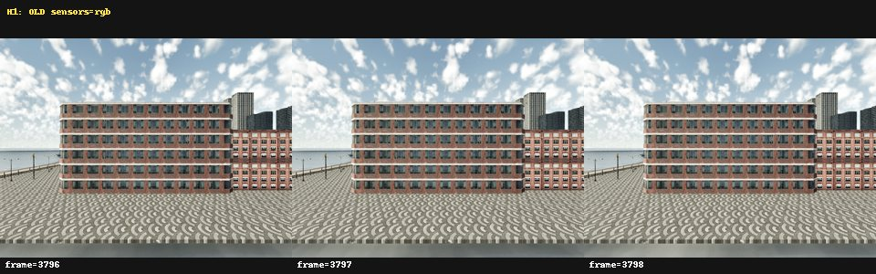
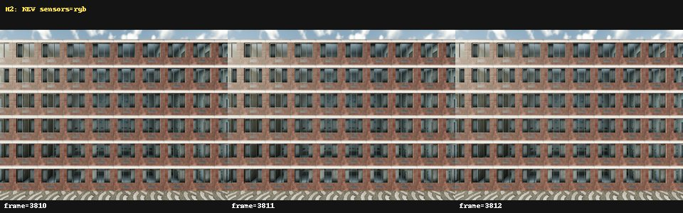
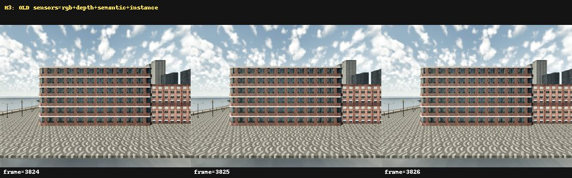
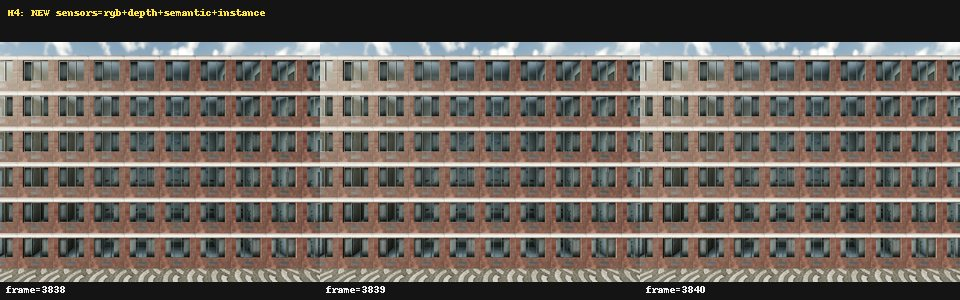
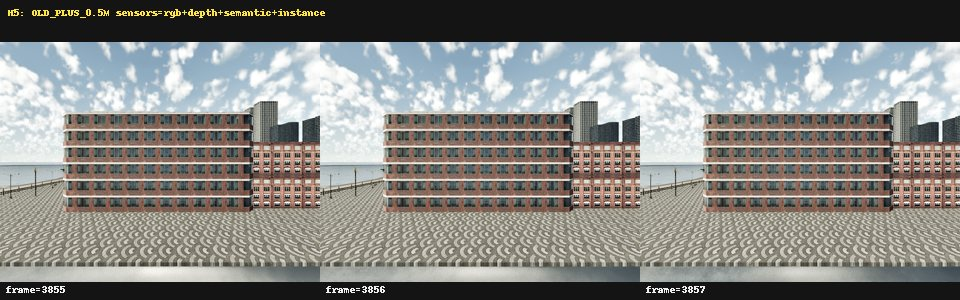
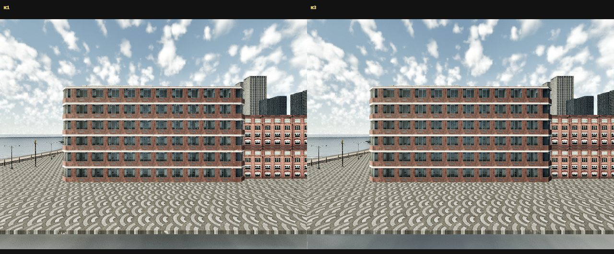
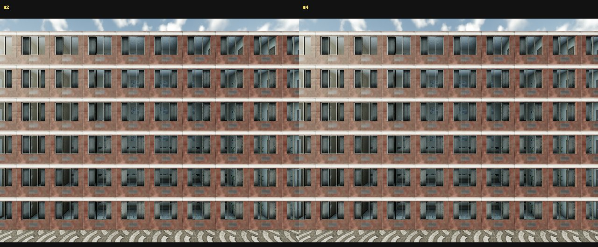
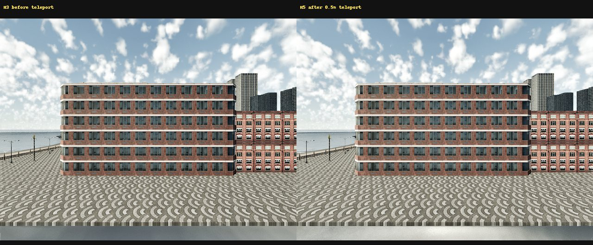
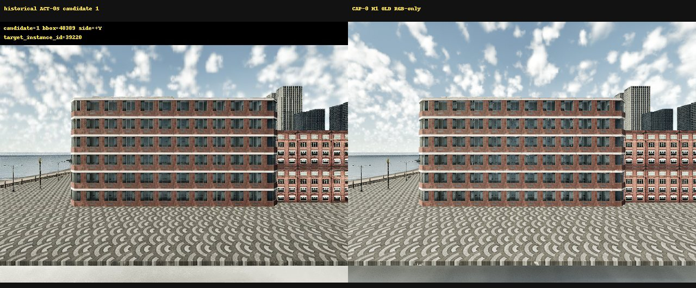

# CAP-0 Sensor Audit

CAP-0 is a bounded diagnosis of the CARLA camera stack. It does not change the
historical ACT-0R result, rerun the adaptive locator, execute a rollout, expand
a dataset or train JEPA.

## Runtime safety

| Control | Value |
| --- | ---: |
| CARLA processes | one server at a time |
| CARLA CPU set | 20-27 |
| CARLA nice | 15 |
| CARLA address-space limit | 17,179,869,184 bytes |
| Python numeric threads | 1 per backend |
| Diagnostic Python address-space limit | 4,294,967,296 bytes |
| Python RSS watchdog | 1,610,612,736 bytes |
| Client timeout | 10 s maximum |
| Tick timeout | 5 s maximum |
| Per-frame queue deadline | 5 s maximum |
| Outer diagnostic timeout | 180 s |
| Saved diagnostic groups | 15 maximum |

The callback copied frame, timestamp, transform, dimensions, FOV and
`bytes(raw_data)` before returning. Persisted RGB BGRA length was required to
equal `640 * 480 * 4 = 1,228,800` bytes and every file received SHA-256 and
size metadata.

## H1-H5 results

| Test | Pose | Sensors | Frames | Duration (s) | Min entropy | Min colors | Min consecutive SSIM | Historical SSIM | Result |
| --- | --- | --- | --- | ---: | ---: | ---: | ---: | ---: | --- |
| H1 | OLD | RGB | 3796-3798 | 0.931 | 7.682 | 62,023 | 0.9963 | 0.5330 | PASS |
| H2 | NEW | RGB | 3810-3812 | 0.757 | 7.465 | 65,663 | 0.9986 | n/a | PASS |
| H3 | OLD | RGB+D+S+I | 3824-3826 | 1.397 | 7.705 | 60,908 | 0.9979 | 0.5583 | PASS |
| H4 | NEW | RGB+D+S+I | 3838-3840 | 1.380 | 7.460 | 65,595 | 0.9983 | n/a | PASS |
| H5 | OLD + 0.5 m | RGB+D+S+I | 3855-3857 | 1.559 | 7.676 | 61,652 | 0.9934 | n/a | PASS |

`D/S/I` means depth, semantic and instance. Every quartet has identical
frame IDs and timestamps. Warmup completed before formal saving, raw BGRA
decoded exactly to the stored PNG, and H5 completed after queue clearing and
three discarded settle ticks.

## Visual evidence

The persisted frames were inspected for the previously observed triangular
copying, tiling and geometry stitching. None is present in these fresh
captures. This Agent inspection does not replace independent external review;
the files below are published for that purpose.

### Three consecutive frames

| H1 | H2 | H3 |
| --- | --- | --- |
|  |  |  |

| H4 | H5 |
| --- | --- |
|  |  |

### Diagnostic comparisons









Each test also publishes `*_raw_vs_png.jpg` and `*_sensors.jpg` panels in
`docs/assets/cap0/`.

## Address-space isolation

The 4 GiB diagnostic completed all five tests. Python peak RSS was
132,874,240 bytes, peak VMS was 2,171,207,680 bytes and the RSS watchdog did
not fire. CARLA peak RSS observed by the trace was 5,398,695,936 bytes.

The one permitted 2 GiB OLD/RGB-only probe did not complete. It reached the
second warmup frame with observed VMS 2,017,296,384 bytes and then hit the
90-second outer timeout (exit 124). No formal probe frame was saved. Because
the identical path passed at 4 GiB and failed near the 2 GiB virtual-address
ceiling, the root cause is:

```text
PYTHON_ADDRESS_SPACE_LIMIT_FAILURE: CONFIRMED
```

The timeout is explicitly retained in
`results/cap0/as2_probe.json`; it is not represented as a normally completed
probe or as an RSS-limit failure. The earlier locator-to-quartet lifecycle
hypothesis is superseded by this controlled limit comparison.

## Gates

| Gate | Result |
| --- | --- |
| TICK_FAIL_FAST | PASS |
| QUEUE_DEADLINE | PASS |
| RAW_BUFFER_OWNERSHIP | PASS |
| RAW_LENGTH_AND_HASH | PASS |
| GPU_WARMUP_COMPLETE | PASS |
| KNOWN_GOOD_POSE_RGB_INTEGRITY | PASS |
| QUARTET_PAIRING_HEALTH | PASS |
| POST_TELEPORT_HEALTH | PASS |
| RENDER_INTEGRITY | PASS |
| ROOT_CAUSE_CLASSIFIED | PASS |
| RSS_WATCHDOG | PASS |
| CAPTURE_STACK_RECOVERED | PASS |

Canonical diagnostic raw remains server-local at
`results/cap0/raw` (48,958,538 bytes by `du -sb`) and is ignored by Git.
