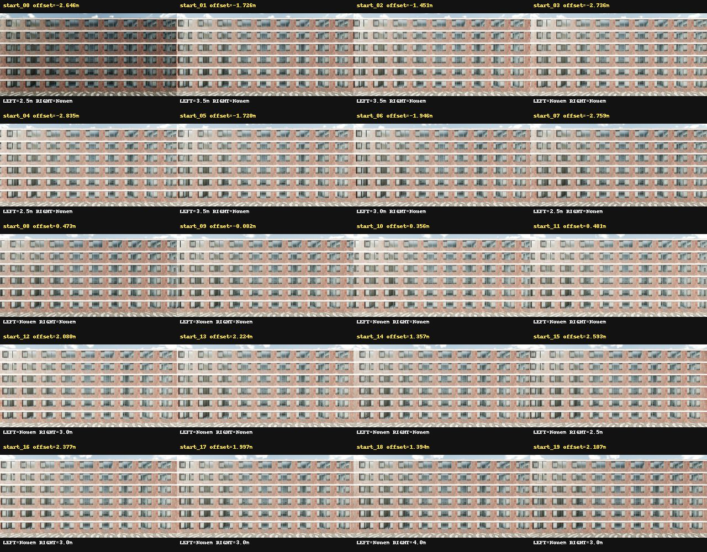
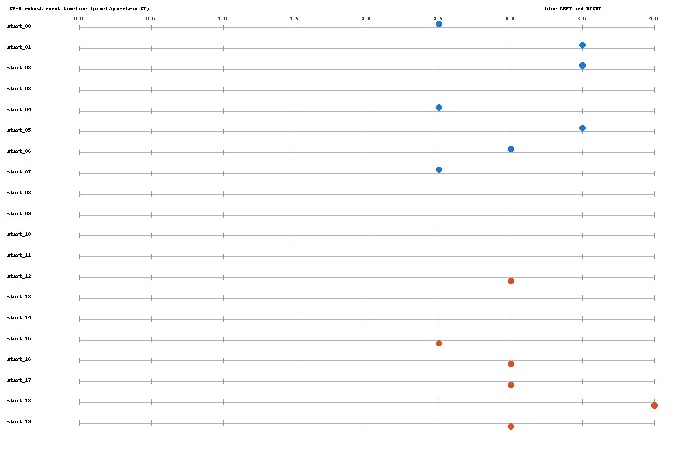
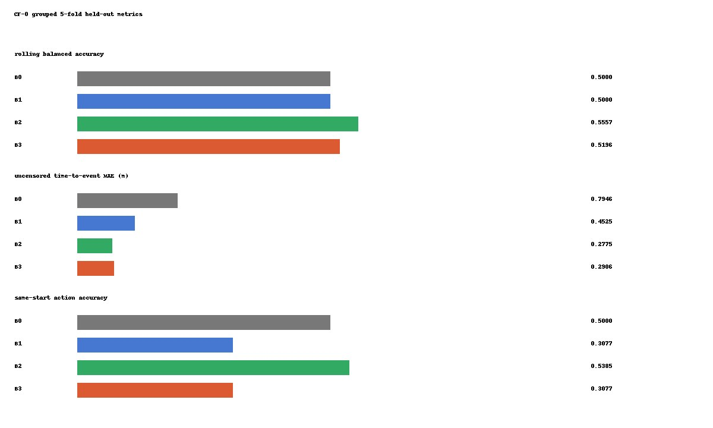
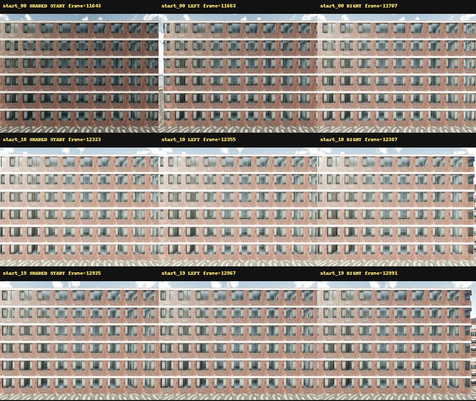

# CF-0 Single-Facade Counterfactual Observability Kill Test

CF-0 uses candidate 1 only. It is a small PCA/linear-probe kill test,
not a JEPA experiment. Raw RGB/depth/semantic/instance data remain
server-local and are not tracked by Git.

## Method

Twenty deterministic shared starts are split into five folds by start ID;
LEFT and RIGHT branches from the same start always remain in the same fold.
All image preprocessing, PCA and linear fitting are fitted on training folds.
Rolling probe rows stop before MODEL_VISIBLE_TERMINATION. Action selection
uses only the shared-start predictions. Absolute coordinates, planned start
offsets, frame IDs, role names and world boundary coordinates are GT/provenance
only and never enter model features.

## Gates

| Gate | Status |
| --- | --- |
| COUNTERFACTUAL_PAIRING | PASS |
| START_BOUNDARY_ABSENT | PASS |
| ROBUST_EVENT_COVERAGE | PASS |
| SPLIT_LEAKAGE_AUDIT | PASS |
| VISUAL_INCREMENTAL_VALUE | FAIL |
| ACTION_SELECTION_SIGNAL | FAIL |
| SINGLE_SURFACE_SIGNAL | FAIL |
| CROSS_SURFACE_GENERALIZATION | NOT_EVALUATED |
| READY_FOR_MULTI_SURFACE_CAPTURE | FAIL |
| READY_FOR_JEPA | NOT_EVALUATED |

## Baselines

| Baseline | Balanced accuracy | AUROC | Brier | TTE MAE (m) | Action accuracy | Regret (m) |
| --- | ---: | ---: | ---: | ---: | ---: | ---: |
| B0 | 0.5000 | 0.3322 | 0.1923 | 0.7946 | 0.5000 | 0.7308 |
| B1 | 0.5000 | 0.5450 | 0.1900 | 0.4525 | 0.3077 | 0.8846 |
| B2 | 0.5557 | 0.6659 | 0.1776 | 0.2775 | 0.5385 | 0.6923 |
| B3 | 0.5196 | 0.6467 | 0.1804 | 0.2906 | 0.3077 | 0.9615 |

## Incremental Value

B3 versus B1 MAE improvement: `0.161939 m`.
B3 versus B1 balanced-accuracy improvement: `0.019612`.
B3 versus B2 MAE improvement: `-0.013102 m`.
B3 versus B1 action-accuracy improvement: `0.000000`.

## Public Evidence

## Scope

`CROSS_SURFACE_GENERALIZATION` and `READY_FOR_JEPA` remain `NOT_EVALUATED`.
No rollout, other-facade capture, model download or JEPA training ran.
