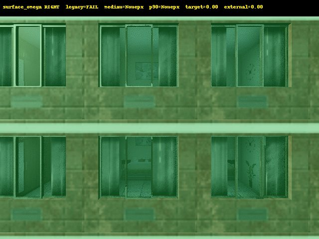
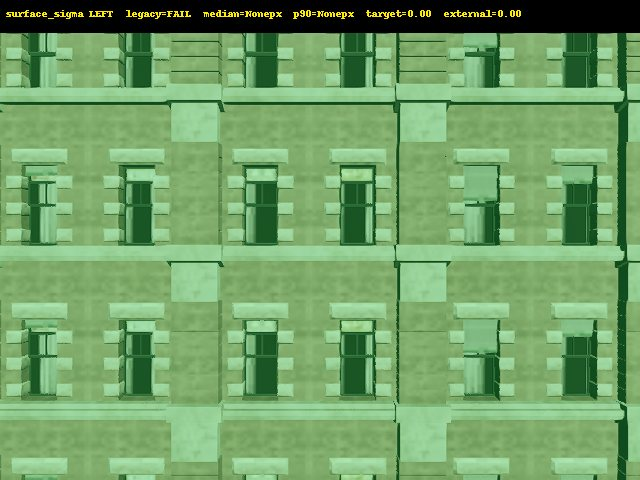
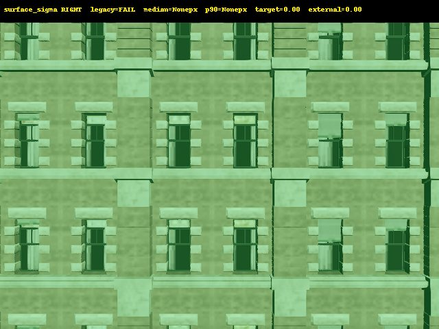
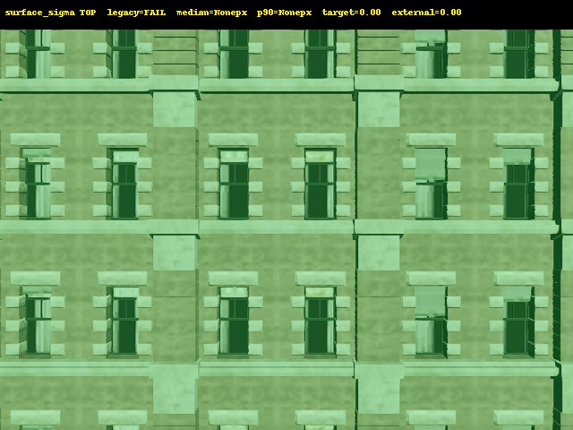
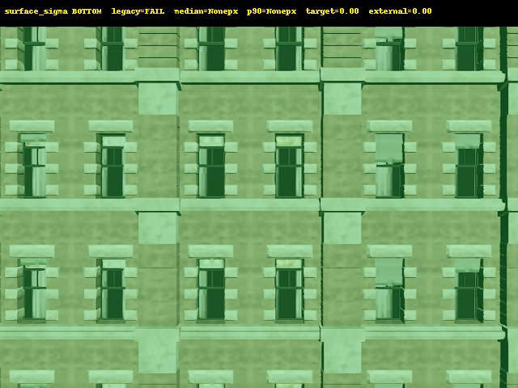

# MASK-0R1 Visual Audit

This audit reuses the existing MASK-0 sensor quartet only. It does not overwrite MASK-0 results, recover GEO-0.6 data, or train JEPA.

## Decoder

Semantic tag: `R`; 16-bit instance ID: `G | (B << 8)`; packed index key: `R | (G << 8) | (B << 16)`. Agreement between independent semantic R and instance R: `1.000000000` (`0` error pixels).

## Gates

| Gate | Status |
|---|---|
| SENSOR_QUADRUPLET_PAIRING | PASS |
| INSTANCE_DECODER_VALID | PASS |
| TARGET_ID_STABILITY | PASS |
| INSTANCE_MASK_REPEATABILITY | PASS |
| FACADE_ENVELOPE_QUALITY | PASS |
| INTERNAL_HOLE_REJECTION | NOT_APPLICABLE |
| LEGACY_EDGE_ALIGNMENT | FAIL |
| VALIDATED_EDGE_SET | PASS |
| AGL_ESTIMATION | FAIL |
| BOTTOM_EDGE_REACHABILITY | NOT_DEMONSTRATED |
| ACTION_SAFETY | PASS |
| READY_FOR_ADAPTIVE_PILOT | PASS |
| READY_FOR_DATASET_EXPANSION | NOT_EVALUATED |
| READY_FOR_JEPA | NOT_EVALUATED |

## Boundary alignment

The old projected-line check is not called alignment. Alignment requires an instance-mask exterior transition contour, side evidence, and distance/support thresholds. The red legacy line is shown against the yellow instance contour in each image.

| Surface | Edge | Legacy median px | Legacy p90 px | Transition frames | Validated edge |
|---|---|---:|---:|---:|---|
| surface_omega | LEFT | None | None | 0 | False |

| surface_omega | RIGHT | None | None | 0 | False |

| surface_omega | TOP | None | None | 0 | False |

| surface_omega | BOTTOM | None | None | 0 | False |

| surface_sigma | LEFT | 28.0 | 30.0 | 6 | True |

| surface_sigma | RIGHT | 51.0 | 52.392747589718944 | 6 | True |

| surface_sigma | TOP | None | None | 6 | False |

| surface_sigma | BOTTOM | None | None | 6 | False |

## Interpretation

- `surface_sigma` LEFT/RIGHT have stable exterior target/non-target transition contours and are the only validated opposite-direction edge pair.
- `surface_omega` legacy lines are inside a continuous target instance; no exterior transition contour validates them.
- `surface_sigma` TOP/BOTTOM also lack a validated exterior transition contour in the existing key poses.
- `INTERNAL_HOLE_REJECTION` is `NOT_APPLICABLE`: the raw masks have no enclosed holes; no synthetic holes were used.
- AGL is not established because the existing downward raycast has no usable ground hit. BOTTOM reachability remains `NOT_DEMONSTRATED`.

Phase B may start only if `READY_FOR_ADAPTIVE_PILOT=PASS`; it must use the actual instance contours as an oracle, not legacy lines.
