# MASK-0 Visual Audit

This is a small CARLA semantic/instance feasibility audit. It does not train JEPA or expand the dataset.

## Gates

| Gate | Status |
|---|---|
| INSTANCE_SENSOR_AVAILABLE | PASS |
| SENSOR_QUADRUPLET_PAIRING | PASS |
| INSTANCE_DECODER_VALID | PASS |
| TARGET_ID_STABILITY | PASS |
| TARGET_INSTANCE_GROUPING | PASS |
| FACADE_ENVELOPE_QUALITY | PASS |
| INTERNAL_HOLE_REJECTION | PASS |
| BOUNDARY_ALIGNMENT | PASS |
| LABEL_STATE_FEASIBILITY | FAIL |
| ACTION_FEASIBILITY | FAIL |
| EXTERNAL_VISUAL_REVIEW | PENDING |
| READY_FOR_SEQUENCE_RECAPTURE | FAIL |
| READY_FOR_DATASET_EXPANSION | NOT_EVALUATED |
| READY_FOR_JEPA | NOT_EVALUATED |

## Sensor and ID evidence

All four blueprints were present and 30 frame groups were captured. Semantic Building tag is `3`; IDs are decoded from raw BGRA and selected from simulator annotations, not hard-coded.

### surface_omega

Target ID group: `[10040323]`; stable in at least `11` of `15` frames.

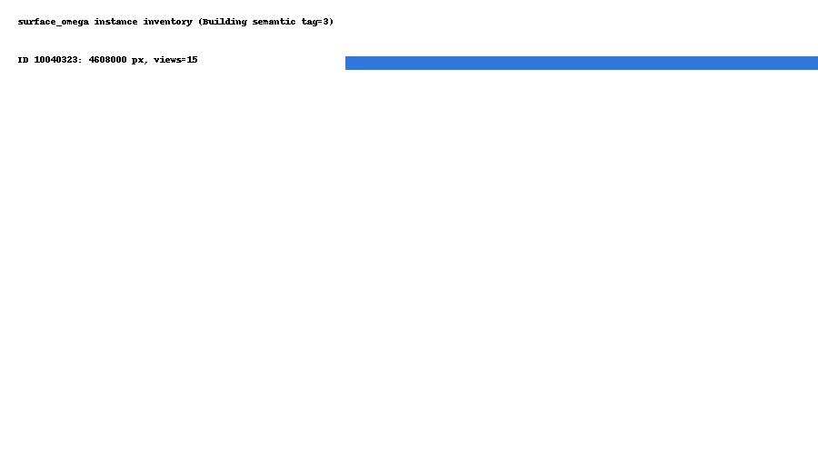

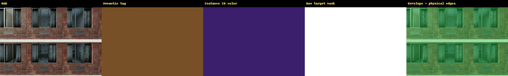

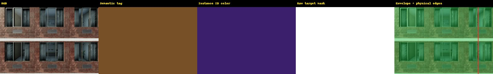
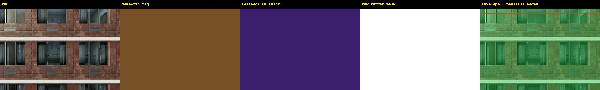
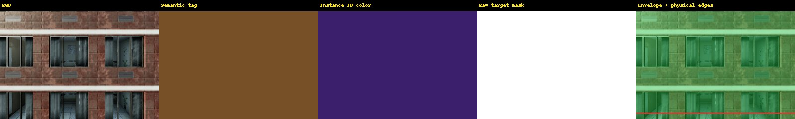

### surface_sigma

Target ID group: `[10047747]`; stable in at least `11` of `15` frames.

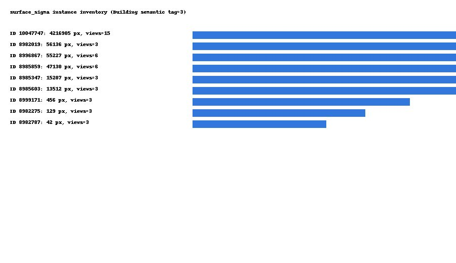

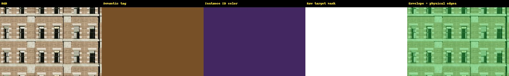
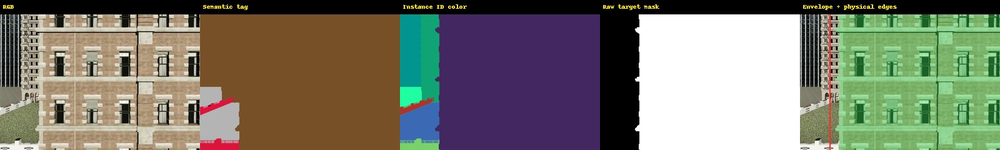
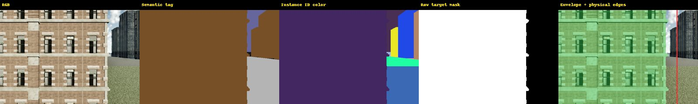
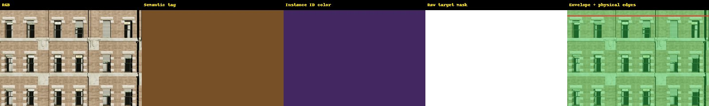
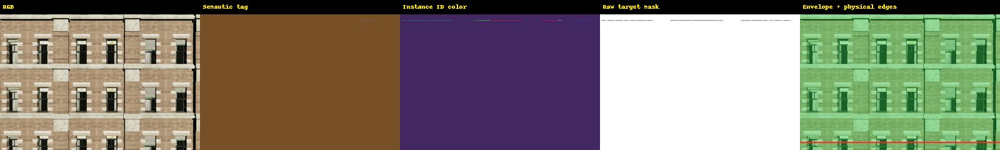

## Key-pose results

| Surface | CENTER | LEFT | RIGHT | TOP | BOTTOM_SAFE_VIEW |
|---|---|---|---|---|---|
| surface_omega | IN/IN/IN | UNKNOWN/UNKNOWN/UNKNOWN | UNKNOWN/UNKNOWN/UNKNOWN | UNKNOWN/UNKNOWN/UNKNOWN | UNKNOWN/UNKNOWN/UNKNOWN |
| surface_sigma | IN/IN/IN | STRADDLE/STRADDLE/STRADDLE | STRADDLE/STRADDLE/STRADDLE | UNKNOWN/UNKNOWN/UNKNOWN | UNKNOWN/UNKNOWN/UNKNOWN |

## Hole and failure evidence

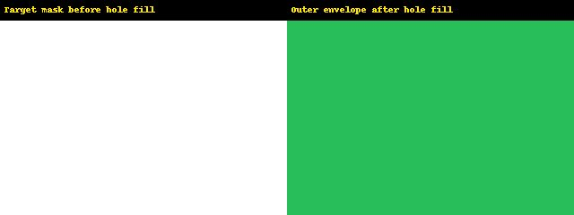

## Post-hoc interpretation

GEO-0.6 is retained as a historical result. Its failure is `PLANE_BASED_LABEL_PROTOCOL=FAIL`: omega has visible outer edges but window/recess depth mismatch, while sigma's collision plane disagrees with rendered depth. DOWN is reported as an AGL-constrained action and is not used to manufacture an underground OUT event.

External visual review remains PENDING. Dataset expansion and JEPA readiness are NOT_EVALUATED.
