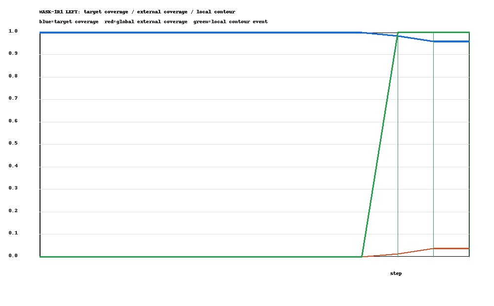
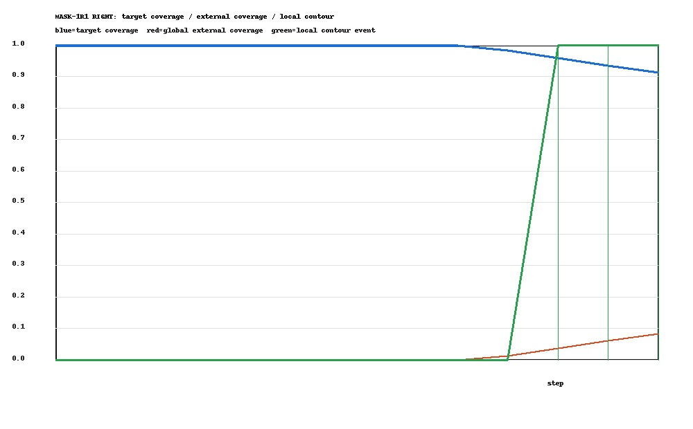
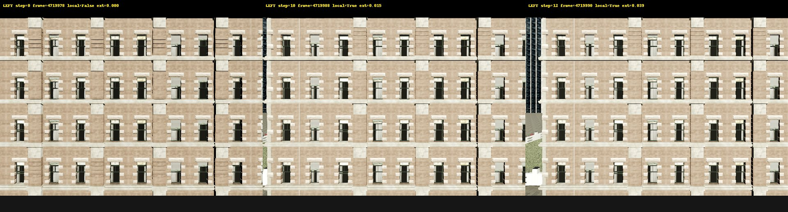
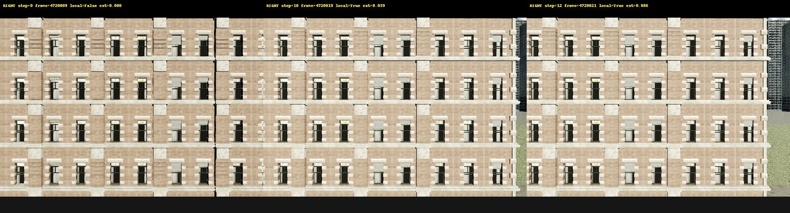
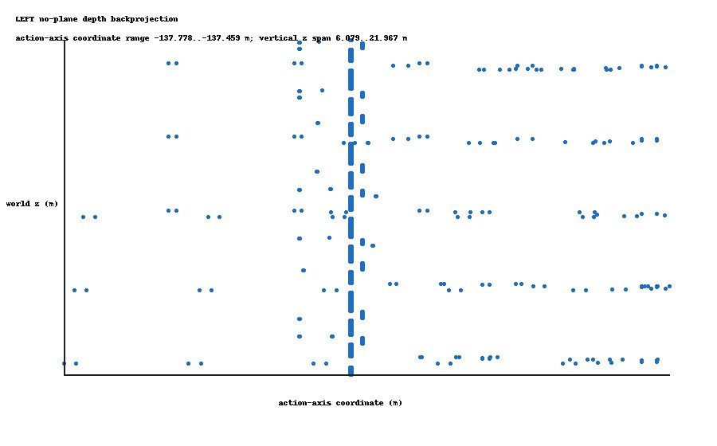
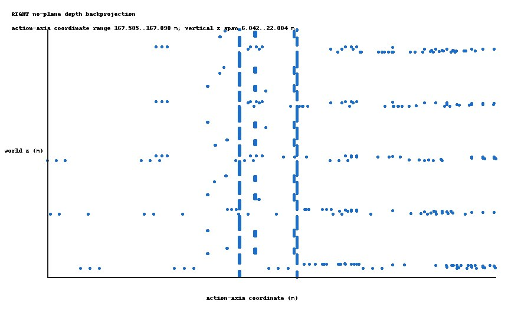

# MASK-1R1 Event Reanalysis

This is an offline reanalysis of the existing `results/mask1/raw` data. CARLA
was not started and the historical MASK-1 result files were not modified.
`EXTERNAL_VISUAL_REVIEW=PENDING` remains the status for the human-visible event.

## Event definitions

`local_straddle` is recomputed from the current target instance mask's exterior
contour, directional span and target/non-target side purity. `global_external_coverage`
is `1 - target_coverage`; thresholds are 3%, 5% and 10%. `NOT_REACHED` is used
when a threshold is never reached.

| Direction | First local | Global 3% | Global 5% | Global 10% | Last step | Overshoot |
|---|---:|---:|---:|---:|---:|---:|
| LEFT | 10 | 11 | NOT_REACHED | NOT_REACHED | 12 | 2 steps / 1.0 m |
| RIGHT | 10 | 10 | 11 | NOT_REACHED | 12 | 2 steps / 1.0 m |





The first local STRADDLE was followed by two distinct camera poses. This is
`MOVING_STRADDLE_PERSISTENCE=PASS`; it is not same-pose confirmation.





## No-legacy-plane boundary backprojection

Target-side contour pixels with valid z-depth were backprojected directly with
the saved `K` and `T_world_camera`. No legacy surface plane, bbox, width/height,
or legacy line was used as an acceptance filter. A robust target-mask depth
consistency check rejects sensor-depth outliers; this is not a plane fit.

| Direction | Action axis | Valid boundary points | Action-axis spread | 0.05 m | 0.10 m | 0.25 m | 1.00 m |
|---|---|---:|---:|---|---|---|---|
| LEFT | `[0,-1,0]` | 596 per STRADDLE frame | 0.000657 m | PASS | PASS | PASS | PASS |
| RIGHT | `[0,1,0]` | 596 per STRADDLE frame | 0.040522 m | PASS | PASS | PASS | PASS |





`WORLD_BOUNDARY_ABSOLUTE_ACCURACY=NOT_EVALUATED`: there is no independent
world-coordinate measurement in the retained data.

## Gates

```text
MASK1_EVENT_REANALYSIS: PASS
FIRST_STRADDLE_DETECTION: PASS
MOVING_STRADDLE_PERSISTENCE: PASS
SAME_POSE_CONFIRMATION: NOT_EVALUATED
STOP_OVERSHOOT: FAIL
WORLD_BOUNDARY_REPEATABILITY: PASS (1.0 m acceptance threshold)
WORLD_BOUNDARY_ABSOLUTE_ACCURACY: NOT_EVALUATED
PREBOUNDARY_MASK_PROGRESS: PRESENT
```

The pre-boundary target mask is exactly 1.0 in the retained frames, but the
global external event begins at different steps from the local contour event.
