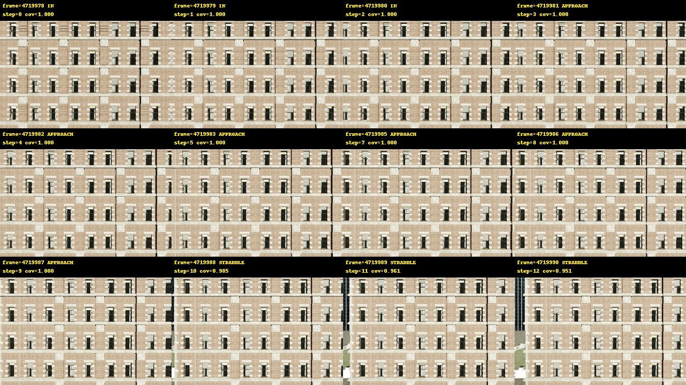
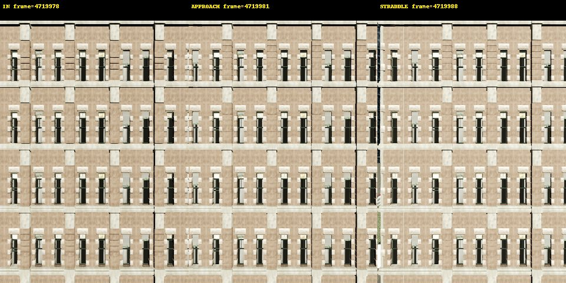
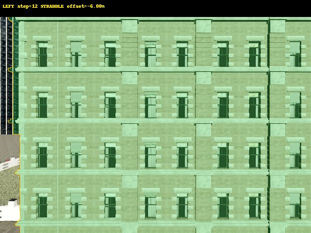
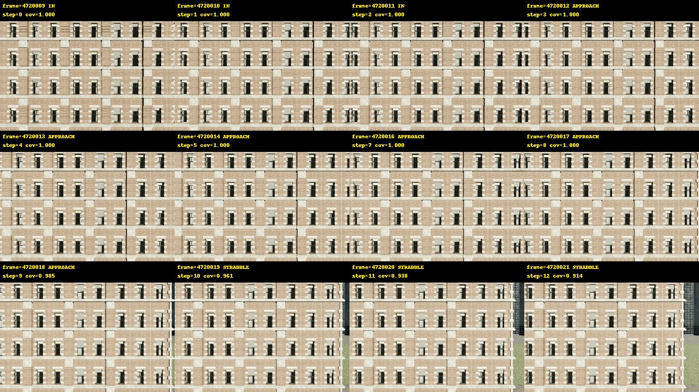
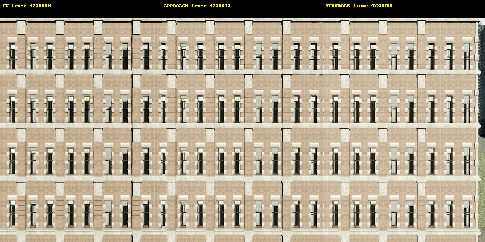
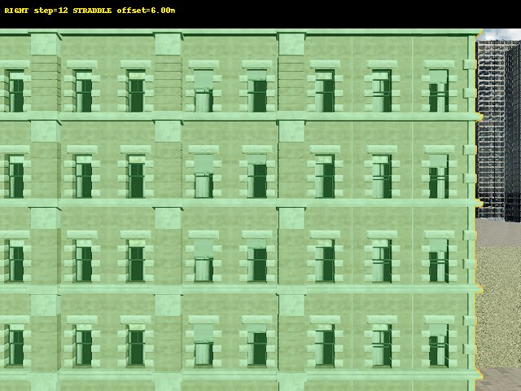

# MASK-1 Visual Audit

This is a small adaptive boundary-search pilot. It uses the simulator instance mask only as a privileged capture oracle; it does not train JEPA or authorize dataset expansion.

## Gates

| Gate | Status |
|---|---|
| MASK1_CAPTURE_PAIRING | PASS |
| NORMAL_LOCK | PASS |
| INITIAL_IN | PASS |
| STRADDLE_CONFIRMATION | PASS |
| ADAPTIVE_STOP | PASS |
| COVERAGE_MONOTONICITY | PASS |
| WORLD_BOUNDARY_ESTIMATE | PASS |
| OPERATOR_VISUAL_REVIEW | PENDING |
| READY_FOR_DATASET_EXPANSION | NOT_EVALUATED |
| READY_FOR_JEPA | NOT_EVALUATED |

## Trajectory summary

| Sequence | Frames | States | UNKNOWN | Reverse coverage jump | World estimates |
|---|---:|---|---:|---:|---:|
| `surface_sigma/MASK-1/10m/LEFT` | 13 | `['IN', 'APPROACH', 'STRADDLE']` | 0.000 | 0.0000 | 3 |

| `surface_sigma/MASK-1/10m/RIGHT` | 13 | `['IN', 'APPROACH', 'STRADDLE']` | 0.000 | 0.0000 | 3 |

## Interpretation

Both trajectories begin with three IN frames and stop after three consecutive directional STRADDLE frames. No OUT state was attempted, and no UNKNOWN frame occurred. Boundary repeatability is gated on surface horizontal-coordinate spread; vertical spread is reported because the visible line height changes with the view. Operator visual review remains PENDING; READY_FOR_JEPA is NOT_EVALUATED.
