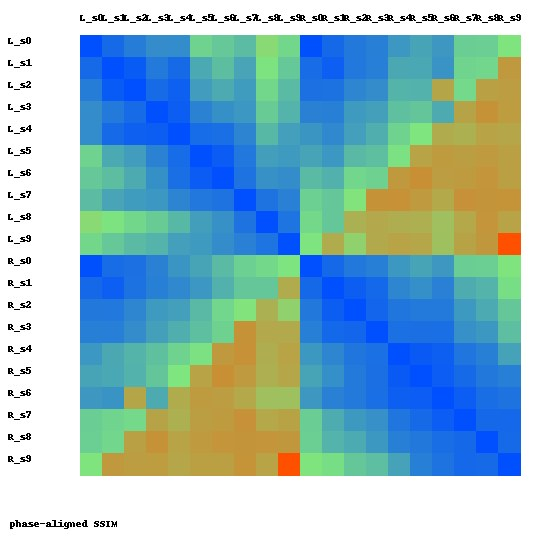
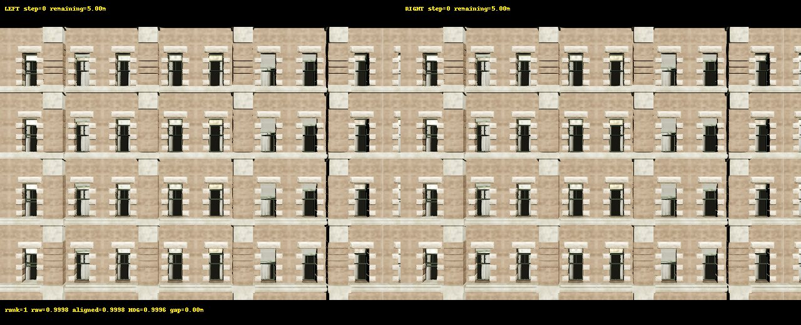
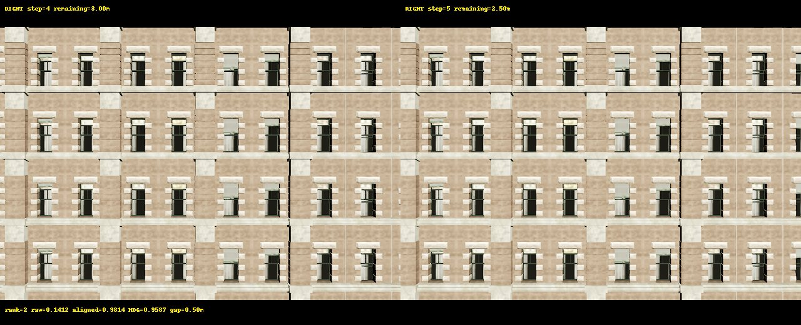
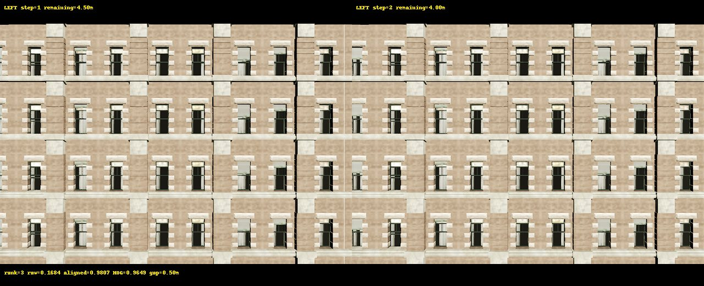
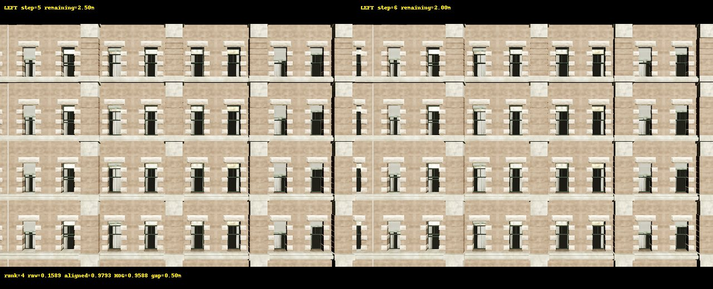
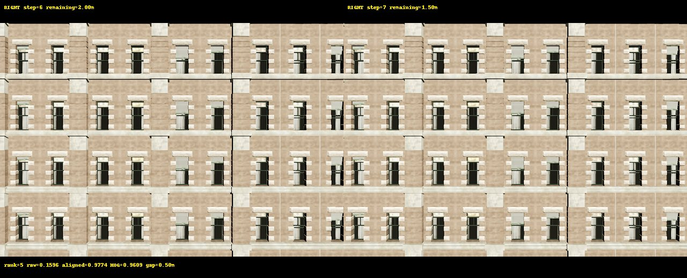

# OBS-0R1 Leakage-Corrected Observability Audit

OBS-0R1 is an offline reanalysis of the 20 pre-STRADDLE MASK-1 RGB frames. It
does not start CARLA, collect new frames, train JEPA, or modify the historical
OBS-0 result files.

## Correction scope

- Previous-frame descriptors are grouped by trajectory.
- Every trajectory's step 0 uses its own current descriptor as a placeholder
  and has `history_valid=false`.
- Ridge standardization is fitted inside each train-direction split.
- RGB descriptors use a deterministic, non-fitted 128-value subsample.
- Wide ridge probes use the sample-space dual system instead of allocating a
  feature-by-feature solve matrix.
- Phase alignment applies the inverse of the shift returned by
  `phaseCorrelate`.

The four historical OBS-0 files are protected by SHA-256 checks recorded in
`results/obs0/history_boundary_audit.json` and
`results/obs0/validation_r1.json`.

## Memory safety

The full analysis ran with one OpenBLAS/OpenMP/MKL/OpenCV thread, a 2 GiB
address-space limit, lower scheduler priority, and a 120 second timeout. The
run completed in 7.51 seconds with a measured peak RSS of 182,620 KiB and no
swap use. The largest ridge solve was 10 x 10 even though the largest probe
feature vector had 262 values.

```text
descriptor dimension: 128
maximum probe feature dimension: 262
maximum train rows: 10
maximum linear system dimension: 10
process address-space limit: 2,147,483,648 bytes
```

## Phase A gates

| Gate | Result | Evidence |
|---|---|---|
| HISTORY_BOUNDARY_LEAKAGE_FIXED | PASS | Both trajectory step-0 history masks are false; previous descriptors never cross groups. |
| TRAIN_ONLY_PREPROCESSING | PASS | Mean and scale are fitted inside each direction-holdout training split. |
| SYNTHETIC_ALIGNMENT_TEST | PASS | Aligned SSIM 0.9913 versus raw SSIM 0.1903 on a known translation. |
| OBS0R1_REPRODUCIBILITY | PASS | 20 records, two trajectories, deterministic descriptors and outputs. |

These gates authorize the ACT-0 pilot. They do not establish visual
observability or readiness for JEPA.

## Probe results

All values below are merged LEFT-to-RIGHT and RIGHT-to-LEFT direction-holdout
MAE. B1 is explicitly a fixed-schedule shortcut, not visual evidence.

| Probe | Inputs | MAE (m) | Improvement over constant (m) |
|---|---|---:|---:|
| B0 | Constant mean | 1.2500 | 0.0000 |
| B1 | Step index | 0.1136 | 1.1364 |
| B2 | Relative odometry | 0.1200 | 1.1300 |
| V0 | Current RGB | 1.0746 | 0.1754 |
| V1 | RGB history | 0.8492 | 0.4008 |
| F1 | RGB history + relative odometry | 0.8365 | 0.4135 |
| A0 | Absolute pose + action direction | 4.1318 | -2.8818 |
| F2 | RGB history + absolute pose + action direction | 0.8727 | 0.3773 |

RGB history improves over current RGB by 0.2253 m MAE. It does not improve
over relative odometry: F1 is 0.7164 m worse than B2. Therefore
`RGB_INCREMENTAL_VALUE_OVER_ODOMETRY` is `FAIL`, and the single-facade result
cannot answer action-selection observability.

## Similarity candidates

The audit compares all 190 frame pairs using raw SSIM, phase-aligned SSIM, HOG
cosine, and color-histogram distance. At phase-aligned SSIM >= 0.95 and target
distance gap >= 1 m, 6 of 144 eligible pairs are candidates. No pair reaches
that threshold at a gap >= 2 m. These are metric-ranked candidates, not proof
that perceptual aliasing is absent.



| Candidate | Image |
|---|---|
| 1 |  |
| 2 |  |
| 3 |  |
| 4 |  |
| 5 |  |

## Conclusion

OBS-0R1 fixes the history-boundary leakage and the unsafe ridge computation.
It also confirms a deterministic schedule shortcut. The existing one-facade,
two-direction sample is insufficient to establish RGB value over odometry or
cross-surface action observability. ACT-0 must use matched counterfactual
LEFT/RIGHT starts across multiple independent facades. JEPA remains
`NOT_EVALUATED` and no training has been run.
