# OBS-0 Boundary-Distance Observability Audit

OBS-0 uses only frames before the recomputed local contour event: 20 frames,
10 LEFT and 10 RIGHT. Instance, semantic and depth data generate the target
distance only; they are excluded from every P0-P6 probe input.

## Pre-boundary facts

Before local STRADDLE, LEFT remains at target coverage `1.0`, but RIGHT step 9
already has `1.526%` external coverage. Therefore
`PREBOUNDARY_MASK_PROGRESS=PRESENT`, while the configured global 3% event still
occurs later. The first non-target pixel appears before the local contour event,
not necessarily at the local contour event.

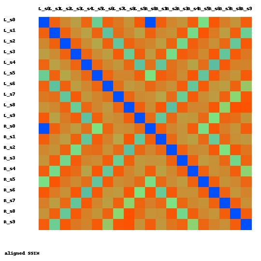

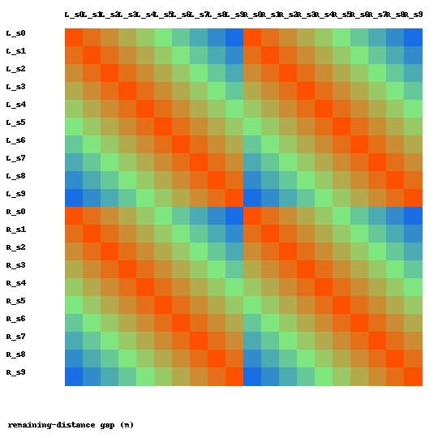

## Visual similarity and alias scan

The scan evaluates all 190 pairs and explicitly reports non-adjacent gaps. No
pair met the requested SSIM thresholds:

| Aligned SSIM | Gap >= 1 m | Gap >= 2 m | Gap >= 3 m |
|---:|---:|---:|---:|
| 0.90 | 0 / 144 | 0 / 84 | 0 / 40 |
| 0.95 | 0 / 144 | 0 / 84 | 0 / 40 |
| 0.98 | 0 / 144 | 0 / 84 | 0 / 40 |

The following are the five strongest non-adjacent candidate pairs, not claimed
aliases because all are below SSIM 0.90. They are included for external review.

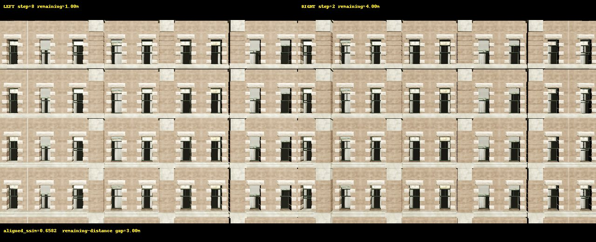
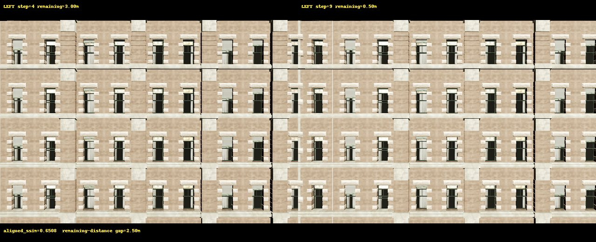
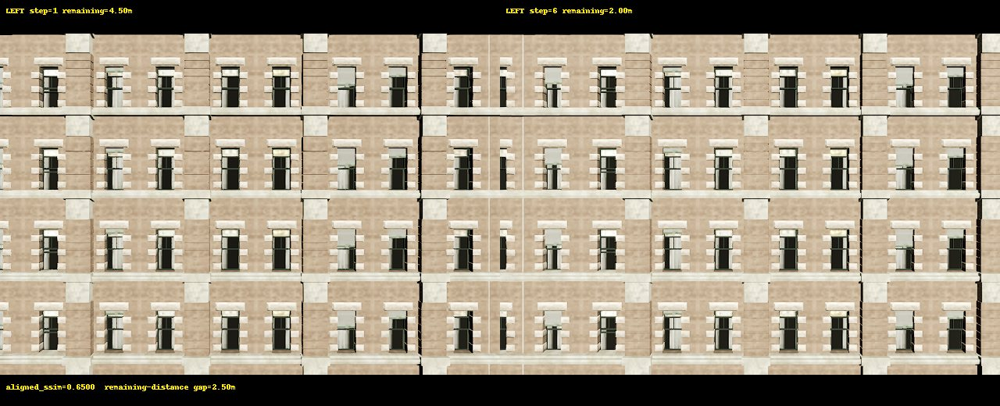
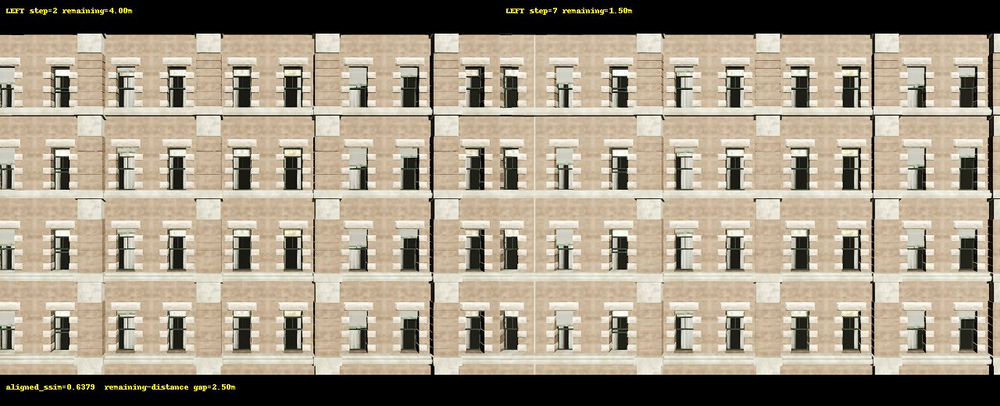
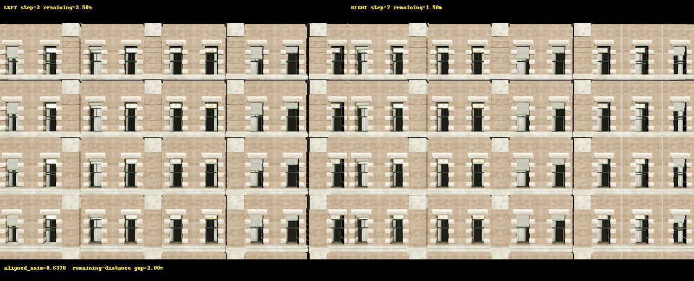

The strongest candidate has aligned SSIM `0.6582` with a 3.0 m remaining-distance
gap. This small two-trajectory sample does not establish or exclude visual
aliasing in other buildings.

## Diagnostic probes

The split is complete direction holdout: train LEFT/test RIGHT and train
RIGHT/test LEFT. No random or adjacent-frame split is used. Values are meters.

| Probe | Input | Aggregate MAE | Median AE | Spearman | Baseline improvement |
|---|---|---:|---:|---:|---:|
| P0 | constant mean | 1.2500 | 1.2500 | n/a | 0.0000 |
| P1 | step + relative odometry | 0.0638 | 0.0623 | 1.0000 | 1.1862 |
| P2 | absolute pose only | 4.1318 | 4.0909 | -1.0000 | -2.8818 |
| P3 | current RGB descriptor | 1.1691 | 1.0175 | -0.0815 | 0.0809 |
| P4 | two-frame RGB change | 2.8740 | 1.4192 | 0.0785 | -1.6240 |
| P5 | RGB history + relative odometry | 1.0793 | 1.0449 | 0.2717 | 0.1707 |
| P6 | RGB history + absolute pose | 1.0829 | 1.0596 | 0.2717 | 0.1671 |

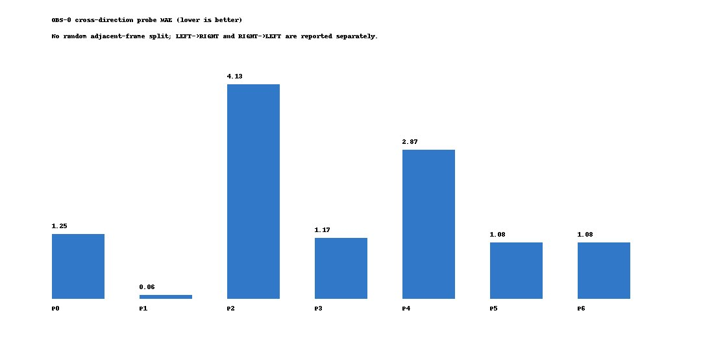

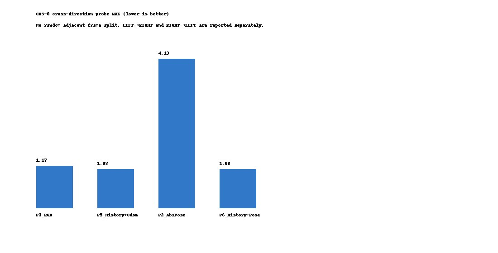

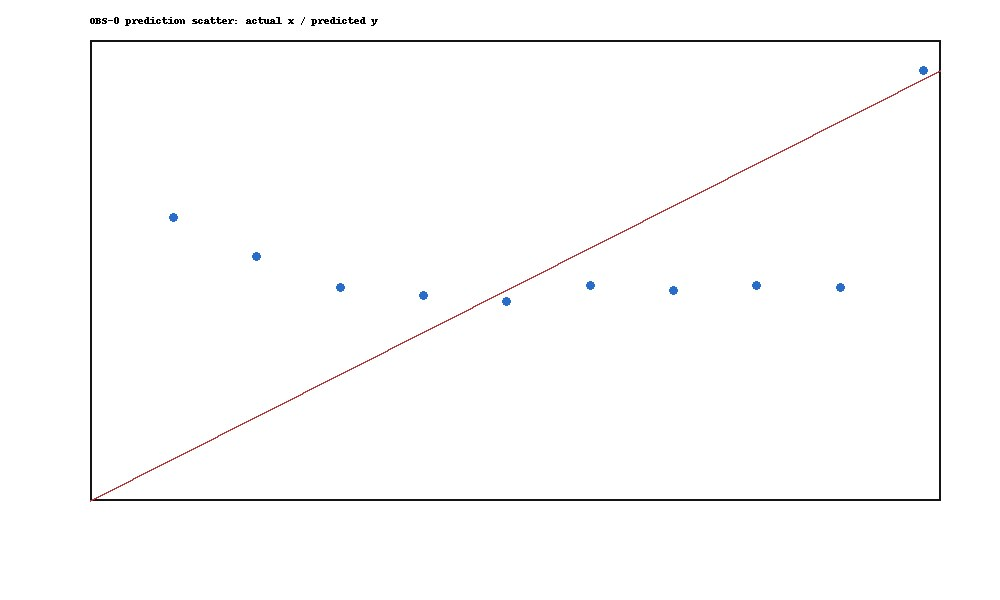
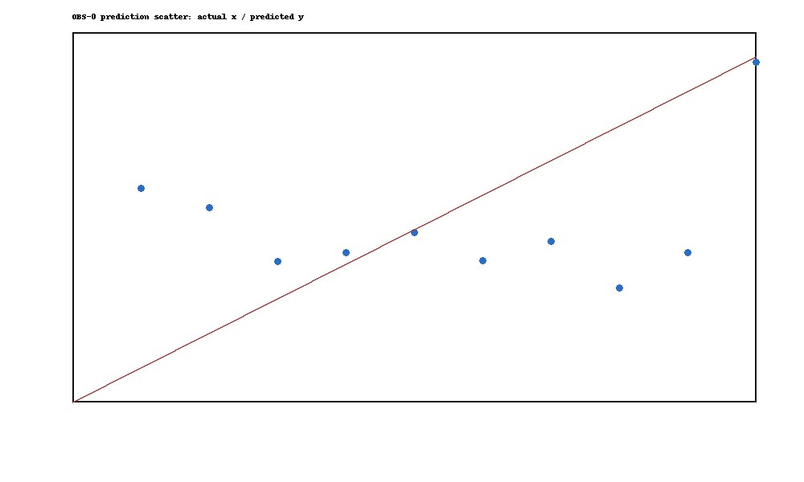

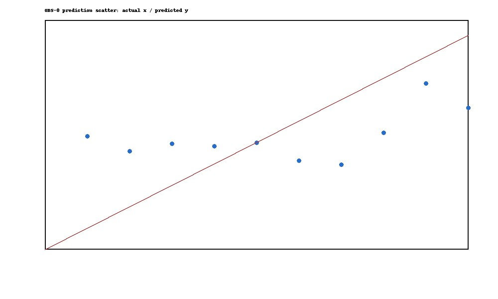
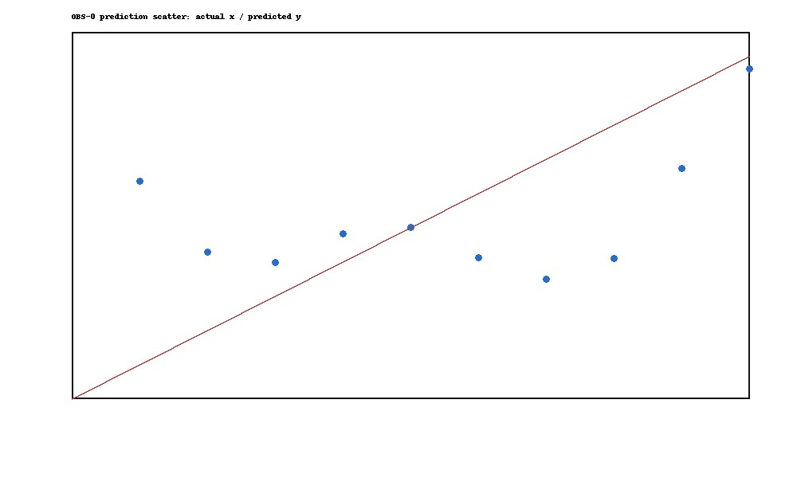


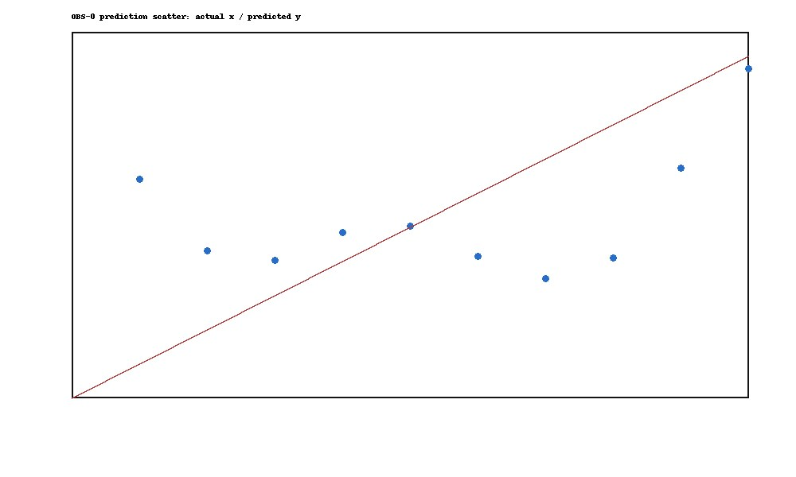

Interpretation is deliberately narrow: the deterministic step/relative-action
schedule is highly predictive in this pilot. Current RGB alone does not pass the
configured 0.1 m improvement gate; history plus odometry gives only a modest
improvement. Absolute pose alone fails this direction holdout. These are not
cross-building generalization results.

## OBS-0 gates

```text
PREBOUNDARY_MASK_PROGRESS: PRESENT
SINGLE_FRAME_RGB_OBSERVABILITY: FAIL
HISTORY_ODOMETRY_OBSERVABILITY: PASS (diagnostic only)
ABSOLUTE_POSE_DEPENDENCE: FAIL
BOUNDARY_DETECTION_OBSERVABILITY: INCONCLUSIVE
BOUNDARY_DISTANCE_OBSERVABILITY: INCONCLUSIVE
ACTION_SELECTION_OBSERVABILITY: NOT_EVALUATED
READY_FOR_MULTI_SURFACE_CAPTURE: CONDITIONAL_PASS
READY_FOR_DATASET_EXPANSION: NOT_EVALUATED
READY_FOR_JEPA: NOT_EVALUATED
```

No action-selection conclusion is possible because the retained data contain no
same-start alternative actions.
