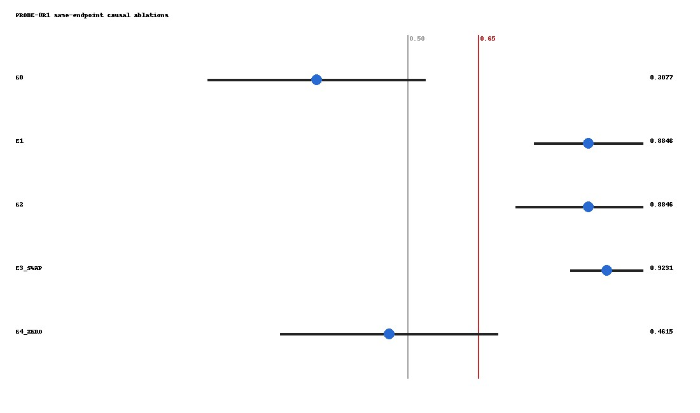
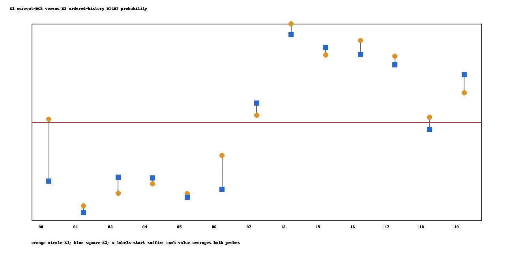
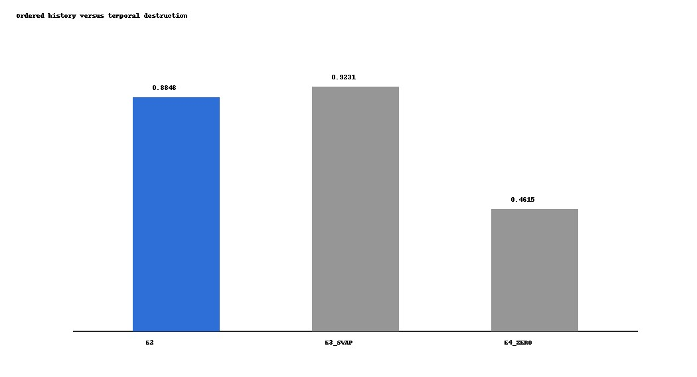
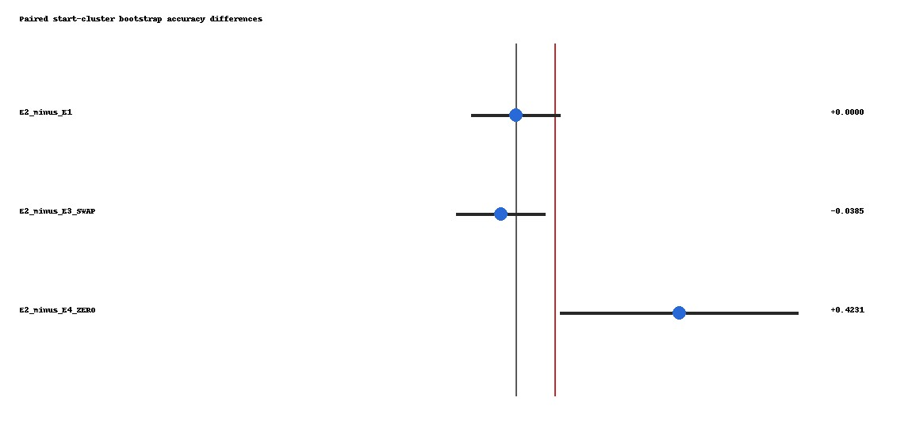

# PROBE-0R1 Causal Attribution Audit

This offline audit uses the frozen 13 starts, 26 samples, 1.0 m endpoints,
folds, seed, RGB descriptor, PCA and ridge settings from PROBE-0. It does
not start CARLA, capture data, download a model or train JEPA.

## Same-Endpoint Ablations

| Ablation | Definition | Accuracy | Balanced accuracy | AUROC | Brier | Regret m |
| --- | --- | ---: | ---: | ---: | ---: | ---: |
| E0 | action + relative odometry | 0.307692 | 0.321429 | 0.297619 | 0.274158 | 1.000000 |
| E1 | current endpoint RGB + action | 0.884615 | 0.886905 | 0.946429 | 0.099341 | 0.173077 |
| E2 | ordered 0.5m/1.0m RGB history + odometry + action | 0.884615 | 0.886905 | 0.976190 | 0.083065 | 0.173077 |
| E3_SWAP | E2 fit normally; held-out previous/current RGB exchanged | 0.923077 | 0.922619 | 0.982143 | 0.078089 | 0.134615 |
| E4_ZERO | E2 fit normally; held-out previous RGB zeroed and history-valid=0 | 0.461538 | 0.500000 | 0.500000 | 0.538462 | 0.807692 |

## Paired Accuracy Differences

| Comparison | Difference | 95% CI |
| --- | ---: | --- |
| E2_minus_E1 | 0.000000 | [-0.115385, 0.115385] |
| E2_minus_E3_SWAP | -0.038462 | [-0.153846, 0.076923] |
| E2_minus_E4_ZERO | 0.423077 | [0.115385, 0.730769] |

## Gates

| Gate | Status | Evidence |
| --- | --- | --- |
| SOURCE_FILE_HASH_AUDIT | PASS | all frozen compact source hashes match |
| RAW_PAYLOAD_HASH_AUDIT | PASS |  |
| STRICT_SAME_ENDPOINT | PASS | all five ablations use the same 26 endpoint records |
| FOLD_REUSE | PASS | all ablations reuse the frozen PROBE-0 start folds |
| FROZEN_MODEL_PIPELINE | PASS | no feature, model, seed or threshold selection |
| E2_REPRODUCES_PROBE0 | PASS | R1 E2 reproduces every frozen PROBE-0 probability |
| TEMPORAL_HISTORY_INCREMENTAL_VALUE | FAIL | E2 does not improve accuracy over E1 or E3_SWAP |
| ACTIVE_JEPA_ROUTE | NO_GO | temporal attribution gate failed |
| READY_FOR_SECOND_SURFACE_REPLICATION | FAIL | stopped by preregistered kill-test rule |
| READY_FOR_JEPA | NOT_EVALUATED | JEPA was outside PROBE-0R1 scope |

## Interpretation

The preregistered temporal-history gates fail. Existing evidence is more consistent with an informative static 1.0 m endpoint than with incremental information from ordered temporal RGB change.

E4_ZERO degradation shows that the fitted E2 classifier uses the previous-RGB
feature block. It does not establish useful temporal order: E1 reaches the same
accuracy using current endpoint RGB alone, and swapping held-out previous/current
RGB in E3_SWAP does not reduce accuracy. The static endpoint explanation is
therefore sufficient for the observed PROBE-0 accuracy gain.

External visual review and cross-surface generalization remain unevaluated.
READY_FOR_JEPA remains NOT_EVALUATED.

## Figures

