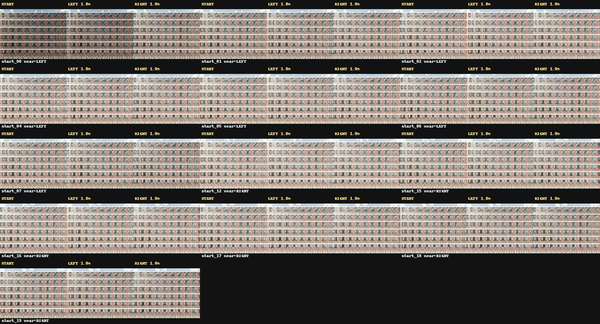
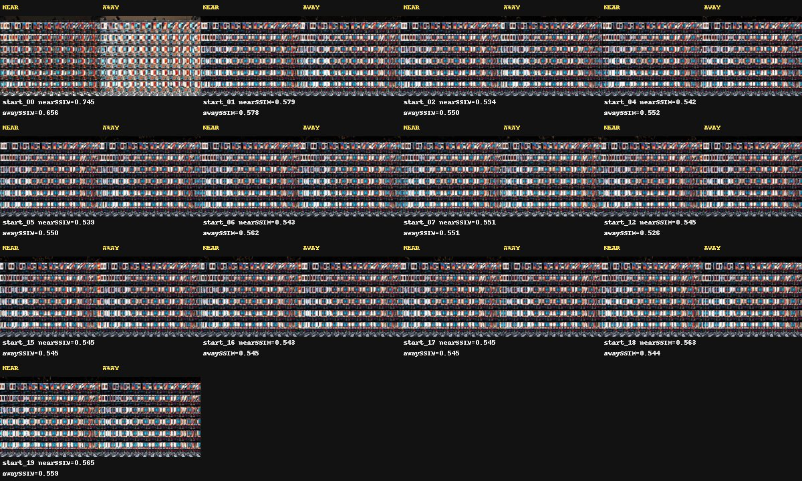
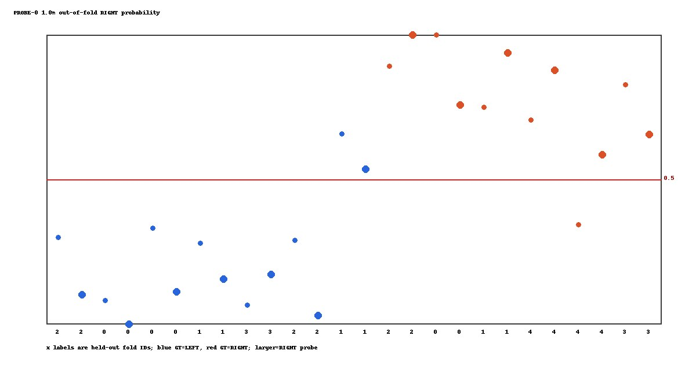
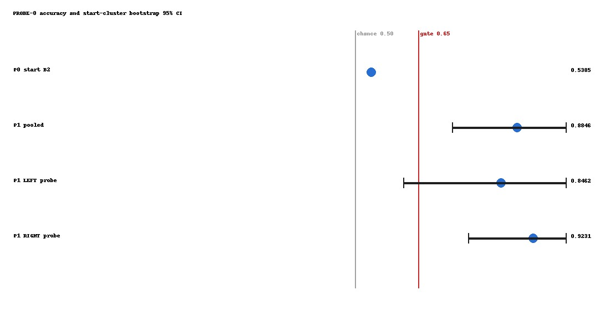

# PROBE-0 Active Disambiguation Solvability Audit

This is a one-shot offline kill test over frozen CF-0 raw. CARLA was not
started, no frames were captured, no model was downloaded and JEPA was not
trained. The 1.0 m result is primary; 0.5 m is diagnostic only.

## Frozen Method

Each probe history is two consecutive 0.5 m steps. The frozen CF-0 B3
feature builder consumes the 0.5 m RGB descriptor as previous, the 1.0 m
descriptor as current, history-valid, relative odometry and probe action.
All 13 start groups remain intact in five folds. PCA and ridge are fitted
inside each training fold. No physical-boundary frame or later frame is input.
Absolute position, start offset, frame ID, planned role and world-boundary
coordinates are retained only for GT/audit and never enter the feature matrix.

## Source And Safety Audit

- Frozen non-tie starts: 13
- Primary samples: 26 (13 per probe direction)
- Unique evidence frames: 65
- Verified payload hashes: 390
- Address-space limit: 4294967296 bytes
- Peak RSS: 192458752 bytes
- Numeric threads: 1

## Primary Metrics

| Scope | Accuracy | Balanced accuracy | AUROC | Brier | Regret m | Accuracy 95% CI |
| --- | ---: | ---: | ---: | ---: | ---: | --- |
| pooled | 0.884615 | 0.886905 | 0.976190 | 0.083065 | 0.173077 | [0.730769, 1.000000] |
| LEFT_probe | 0.846154 | 0.845238 | 0.976190 | 0.109752 | 0.192308 | [0.615385, 1.000000] |
| RIGHT_probe | 0.923077 | 0.928571 | 1.000000 | 0.056378 | 0.153846 | [0.769231, 1.000000] |

Frozen P0 B2 accuracy is 0.538462; the fixed
1.0 m pooled improvement is 0.346154.

The preregistered gates are pooled accuracy >= 0.65, improvement >=
0.10, pooled start-cluster CI lower bound > 0.50, and both directional
accuracies >= 0.65. All six integrity/performance conditions pass.

## Diagnostic 0.5 m Result

The non-gated 0.5 m pooled accuracy is 0.807692,
balanced accuracy is 0.815476, AUROC is
0.970238, and mean regret is
0.326923 m. It was not used for distance selection.
No 2.0 m or later result was computed.

## Errors And Scope

The primary errors are start_07 under both probes and start_18 under the
LEFT probe. This is one facade with 13 independent start clusters; it does
not establish cross-surface generalization. External visual review is
pending, and the result authorizes only a second-surface replication.

## Gates

| Gate | Status |
| --- | --- |
| SOURCE_RAW_HASH_AUDIT | PASS |
| FROZEN_GT_REUSE | PASS |
| FEATURE_PIPELINE_FROZEN | PASS |
| GROUP_SPLIT_LEAKAGE_AUDIT | PASS |
| PREBOUNDARY_INPUT_AUDIT | PASS |
| ACTIVE_DISAMBIGUATION_SIGNAL | PASS |
| ACTIVE_FACADE_JEPA_ROUTE | CONDITIONAL_GO |
| READY_FOR_NEW_CAPTURE | CONDITIONAL_PASS |
| READY_FOR_SECOND_SURFACE_REPLICATION | CONDITIONAL_PASS |
| EXTERNAL_VISUAL_REVIEW | PENDING |
| READY_FOR_JEPA | NOT_EVALUATED |

## Visual Evidence

